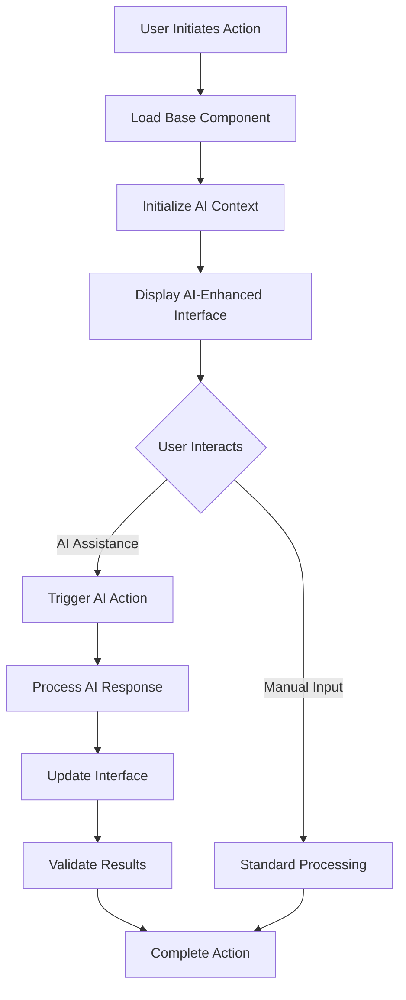
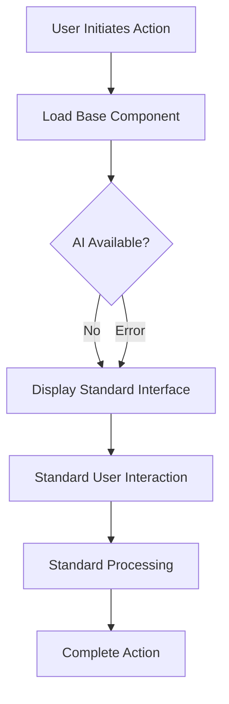
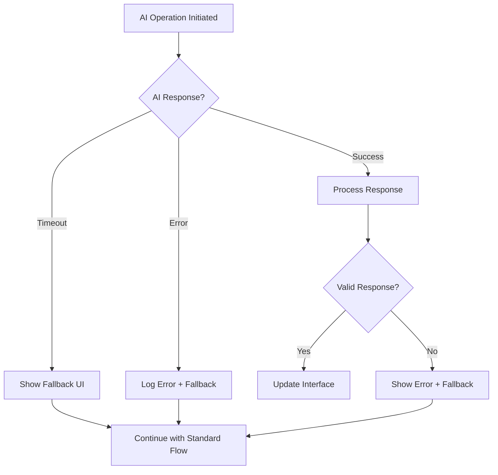

# PRP Template: AGUI Feature Implementation

**Template Version**: 1.0
**Last Updated**: 2024-10-11
**Specialist**: GUI Specialist

> This template guides the implementation of AI-Generated User Interface (AGUI) features using CopilotKit integration patterns.

## 1. Feature Overview

### Feature Name
`[Clear, descriptive name for the AGUI feature]`

### Feature Type
- [ ] AI-Enhanced Form
- [ ] Intelligent Data Display
- [ ] AI-Assisted Navigation
- [ ] Smart Content Generation
- [ ] Predictive User Interface
- [ ] Custom AI Integration

### Primary User Story
```
As a [user type]
I want [AI-enhanced capability]
So that [benefit/outcome]
```

### Success Metrics
- **User Engagement**: `[specific metric, e.g., 40% increase in form completion]`
- **AI Effectiveness**: `[AI-specific metric, e.g., 85% accurate suggestions]`
- **Performance**: `[technical metric, e.g., <200ms AI response time]`

## 2. Inputs & Requirements

### 2.1 Functional Requirements

#### Core Functionality
- [ ] `[Primary feature requirement 1]`
- [ ] `[Primary feature requirement 2]`
- [ ] `[Primary feature requirement 3]`

#### AI Integration Requirements
- [ ] **CopilotKit Actions**: `[Describe required AI actions]`
- [ ] **Readable Context**: `[What data/state must be AI-accessible]`
- [ ] **AI Triggers**: `[When/how AI features activate]`
- [ ] **Fallback Behavior**: `[Non-AI functionality required]`

#### Data Requirements
- [ ] **Input Data Schema**: `[Required data structure]`
- [ ] **Output Data Schema**: `[Expected result format]`
- [ ] **Context Data**: `[Additional context needed for AI]`
- [ ] **Validation Rules**: `[Data validation requirements]`

### 2.2 Non-Functional Requirements

#### Performance
- [ ] **AI Response Time**: `≤ [X]ms for AI operations`
- [ ] **UI Responsiveness**: `≤ [X]ms for UI updates`
- [ ] **Error Recovery**: `≤ [X]s for fallback activation`

#### Accessibility
- [ ] **WCAG Compliance**: `Level AA minimum`
- [ ] **Screen Reader**: `Compatible with ARIA standards`
- [ ] **Keyboard Navigation**: `Full functionality without mouse`
- [ ] **AI State Communication**: `Clear indication of AI activity`

#### Security & Privacy
- [ ] **Data Sanitization**: `All AI inputs/outputs sanitized`
- [ ] **Privacy Compliance**: `User data handling requirements`
- [ ] **Error Handling**: `No sensitive data in error messages`

## 3. User Journey Flow

### 3.1 Primary Flow (AI-Enhanced)



### 3.2 Fallback Flow (AI Unavailable)



### 3.3 Error Handling Flow



## 4. Component States

### 4.1 Loading States

```typescript
interface LoadingStates {
  initial: boolean;      // Component mounting
  aiInitializing: boolean; // AI context setup
  aiProcessing: boolean;   // AI operation in progress
  validating: boolean;     // Response validation
  saving: boolean;         // Data persistence
}
```

### 4.2 AI States

```typescript
interface AIStates {
  available: boolean;      // AI services reachable
  contextReady: boolean;   // AI has necessary context
  suggestions: AIResponse | null; // Current AI suggestions
  confidence: number;      // AI confidence level (0-1)
  lastUpdate: Date;        // When AI last provided input
}
```

### 4.3 Error States

```typescript
interface ErrorStates {
  aiUnavailable: boolean;  // AI services down
  invalidResponse: boolean; // AI returned invalid data
  networkError: boolean;   // Connection issues
  validationError: string | null; // User input validation
  generalError: string | null;    // Other errors
}
```

### 4.4 Data States

```typescript
interface DataStates {
  formData: TFormData;     // Current form state
  originalData: TFormData; // Baseline for comparison
  isDirty: boolean;        // Has user made changes
  isValid: boolean;        // Passes validation
  aiSuggestions: TSuggestion[]; // AI-provided suggestions
}
```

## 5. Implementation Checklist

### 5.1 Setup & Configuration

- [ ] **Install Dependencies**
  ```bash
  npm install @copilotkit/react-core @copilotkit/react-ui
  ```

- [ ] **Configure CopilotKit Provider**
  ```typescript
  // Wrap component tree with CopilotKit
  <CopilotKit publicApiKey="..." url="/api/copilotkit">
  ```

- [ ] **Setup API Endpoints**
  ```typescript
  // Create /api/copilotkit route for AI operations
  ```

### 5.2 Component Structure

- [ ] **Base Component** (`components/[feature]/[Feature].tsx`)
  ```typescript
  // Main component with AI integration
  ```

- [ ] **Fallback Component** (`components/[feature]/[Feature]Fallback.tsx`)
  ```typescript
  // Non-AI version of the component
  ```

- [ ] **Types Definition** (`types/[feature].ts`)
  ```typescript
  // TypeScript interfaces and types
  ```

- [ ] **Custom Hooks** (`hooks/[feature]/use[Feature].ts`)
  ```typescript
  // Reusable logic and state management
  ```

### 5.3 CopilotKit Integration

- [ ] **Readable Context Setup**
  ```typescript
  useCopilotReadable({
    description: "Context description",
    value: contextData,
  });
  ```

- [ ] **AI Actions Implementation**
  ```typescript
  useCopilotAction({
    name: "actionName",
    description: "Action description",
    parameters: [...],
    handler: async (params) => { /* implementation */ },
  });
  ```

- [ ] **Error Boundary Integration**
  ```typescript
  <AIErrorBoundary fallback={<FallbackComponent />}>
    <AIEnhancedComponent />
  </AIErrorBoundary>
  ```

### 5.4 State Management

- [ ] **Loading State Handling**
  ```typescript
  const [isLoading, setIsLoading] = useState(false);
  ```

- [ ] **Error State Management**
  ```typescript
  const [error, setError] = useState<string | null>(null);
  ```

- [ ] **AI State Tracking**
  ```typescript
  const [aiState, setAIState] = useState<AIStates>(defaultState);
  ```

### 5.5 UI Implementation

- [ ] **Loading Indicators**
  ```typescript
  {isLoading && <LoadingSpinner />}
  ```

- [ ] **Error Messages**
  ```typescript
  {error && <ErrorAlert message={error} />}
  ```

- [ ] **AI Status Indicators**
  ```typescript
  <AIStatusBadge state={aiState} />
  ```

- [ ] **Progressive Enhancement**
  ```typescript
  {aiAvailable ? <AIFeatures /> : <StandardFeatures />}
  ```

## 6. Testing Strategy

### 6.1 Unit Tests

- [ ] **Component Rendering**
  ```typescript
  test('renders without AI features when disabled', () => {
    render(<Component aiEnabled={false} />);
    expect(screen.getByText('Standard view')).toBeInTheDocument();
  });
  ```

- [ ] **AI Actions**
  ```typescript
  test('handles AI action responses correctly', async () => {
    const mockAction = jest.fn().mockResolvedValue(mockResponse);
    // Test AI action handling
  });
  ```

- [ ] **Error Handling**
  ```typescript
  test('falls back gracefully when AI fails', () => {
    // Test error scenarios and fallbacks
  });
  ```

### 6.2 Integration Tests

- [ ] **AI Service Integration**
  ```typescript
  test('integrates with CopilotKit actions', async () => {
    // Test full AI integration flow
  });
  ```

- [ ] **State Synchronization**
  ```typescript
  test('syncs state between AI and UI', () => {
    // Test state management
  });
  ```

### 6.3 E2E Tests

- [ ] **Complete User Journey**
  ```typescript
  test('user can complete task with AI assistance', async () => {
    // Test full user workflow
  });
  ```

- [ ] **Fallback Scenarios**
  ```typescript
  test('user can complete task without AI', async () => {
    // Test non-AI workflow
  });
  ```

### 6.4 Accessibility Tests

- [ ] **Screen Reader Compatibility**
  ```typescript
  test('announces AI state changes to screen readers', () => {
    // Test ARIA attributes and announcements
  });
  ```

- [ ] **Keyboard Navigation**
  ```typescript
  test('all AI features accessible via keyboard', () => {
    // Test keyboard-only interaction
  });
  ```

## 7. Acceptance Criteria

### 7.1 Functional Acceptance

- [ ] ✅ **Core Feature Works**: `[Primary functionality operational]`
- [ ] ✅ **AI Enhancement Active**: `[AI features provide value]`
- [ ] ✅ **Fallback Functional**: `[Works without AI]`
- [ ] ✅ **Data Validation**: `[All inputs/outputs validated]`
- [ ] ✅ **Error Recovery**: `[Graceful error handling]`

### 7.2 Performance Acceptance

- [ ] ✅ **Load Time**: `≤ [X]ms initial load`
- [ ] ✅ **AI Response**: `≤ [X]ms for AI operations`
- [ ] ✅ **UI Responsiveness**: `No blocking operations`
- [ ] ✅ **Memory Usage**: `≤ [X]MB additional memory`

### 7.3 Quality Acceptance

- [ ] ✅ **WCAG AA Compliance**: `Accessibility validated`
- [ ] ✅ **Cross-Browser Support**: `Works in target browsers`
- [ ] ✅ **Mobile Responsive**: `Functions on mobile devices`
- [ ] ✅ **TypeScript Coverage**: `100% type coverage`
- [ ] ✅ **Test Coverage**: `≥90% code coverage`

### 7.4 AI-Specific Acceptance

- [ ] ✅ **AI Accuracy**: `≥[X]% accurate suggestions`
- [ ] ✅ **Context Awareness**: `AI uses relevant context`
- [ ] ✅ **Response Quality**: `AI responses are helpful`
- [ ] ✅ **Privacy Compliance**: `No sensitive data exposed`

## 8. Documentation Requirements

### 8.1 Developer Documentation

- [ ] **Component API Documentation**
  ```typescript
  /**
   * AI-enhanced [feature] component
   * @param props - Component properties
   * @param props.aiEnabled - Enable AI features
   * @param props.fallbackMode - Force fallback mode
   */
  ```

- [ ] **Usage Examples**
  ```typescript
  // Basic usage
  <FeatureComponent data={data} />

  // With AI disabled
  <FeatureComponent data={data} aiEnabled={false} />
  ```

- [ ] **Integration Guide**
  ```markdown
  ## Integration Steps
  1. Install dependencies
  2. Configure CopilotKit
  3. Import component
  4. Handle state updates
  ```

### 8.2 User Documentation

- [ ] **Feature Overview**: `[User-facing description]`
- [ ] **How to Use AI Features**: `[Step-by-step guide]`
- [ ] **Troubleshooting**: `[Common issues and solutions]`
- [ ] **Privacy Information**: `[Data handling explanation]`

## 9. Deployment Checklist

### 9.1 Pre-Deployment

- [ ] **Code Review**: `All code reviewed and approved`
- [ ] **Testing Complete**: `All tests passing`
- [ ] **Performance Verified**: `Meets performance criteria`
- [ ] **Security Review**: `Security checklist completed`

### 9.2 Deployment

- [ ] **Feature Flags**: `Deploy behind feature flag initially`
- [ ] **Monitoring Setup**: `AI operation monitoring configured`
- [ ] **Error Tracking**: `Error reporting configured`
- [ ] **Analytics**: `Usage tracking implemented`

### 9.3 Post-Deployment

- [ ] **Smoke Tests**: `Basic functionality verified`
- [ ] **AI Health Check**: `AI operations working correctly`
- [ ] **Performance Monitoring**: `Performance within targets`
- [ ] **User Feedback**: `Feedback collection active`

---

## Template Usage Instructions

1. **Copy this template** for each new AGUI feature implementation
2. **Rename the file** to match your feature: `PRP_[PROJECT]_[FEATURE]_AGUI.md`
3. **Fill in all sections** with feature-specific details
4. **Check off items** as they are completed
5. **Update acceptance criteria** to match your specific requirements
6. **Review and validate** with stakeholders before implementation

---

*This template should be updated based on lessons learned and new AGUI patterns that emerge in the CE-Hub ecosystem.*