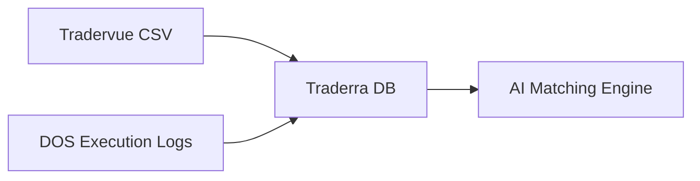

# DOS + Tradervue Integration System
**Detailed Executions + Risk Management Data**

## 🎯 **OBJECTIVE**

Combine the best of both platforms:
- **Tradervue**: Risk values, initial risk, strategy notes, P&L calculations
- **DOS Trader**: Detailed execution data, partial fills, precise timestamps

## 📊 **DATA ARCHITECTURE**

### **Master Trade Record (Enhanced)**
```json
{
  "tradeId": "GWH_20251010_001",
  "symbol": "GWH",
  "date": "2025-10-10",

  // Tradervue Data (Master Record)
  "tradervue": {
    "entryTime": "09:42:00",
    "exitTime": "11:46:00",
    "entryPrice": 3.38,
    "exitPrice": 3.34,
    "quantity": 16920,
    "pnl": -503.93,
    "commission": 63.50,
    "initialRisk": 1000.00,    // CRITICAL - only in Tradervue
    "riskMultiple": -0.17,     // CRITICAL - only in Tradervue
    "strategy": "os_d1",       // CRITICAL - only in Tradervue
    "notes": "...",            // CRITICAL - only in Tradervue
    "tags": ["momentum", "short"]
  },

  // DOS Execution Details (Enrichment Data)
  "dos_executions": [
    {
      "time": "09:42:15.234",
      "side": "sell_short",
      "quantity": 5000,
      "price": 3.385,
      "venue": "ARCA",
      "execution_id": "DOS_123456"
    },
    {
      "time": "09:42:18.567",
      "side": "sell_short",
      "quantity": 8000,
      "price": 3.378,
      "venue": "NASDAQ",
      "execution_id": "DOS_123457"
    },
    {
      "time": "09:42:22.890",
      "side": "sell_short",
      "quantity": 3920,
      "price": 3.376,
      "venue": "EDGX",
      "execution_id": "DOS_123458"
    },
    // Exit executions...
    {
      "time": "11:46:05.123",
      "side": "buy_to_cover",
      "quantity": 7000,
      "price": 3.342,
      "venue": "ARCA",
      "execution_id": "DOS_789123"
    },
    {
      "time": "11:46:08.456",
      "side": "buy_to_cover",
      "quantity": 9920,
      "price": 3.338,
      "venue": "NASDAQ",
      "execution_id": "DOS_789124"
    }
  ],

  // Computed Fields (AI Generated)
  "execution_stats": {
    "total_executions": 5,
    "entry_executions": 3,
    "exit_executions": 2,
    "avg_entry_price": 3.380,
    "avg_exit_price": 3.340,
    "execution_timespan": "2h 3m 53s",
    "slippage": 0.002,
    "venues_used": ["ARCA", "NASDAQ", "EDGX"]
  }
}
```

## 🔄 **INTEGRATION WORKFLOW**

### **Phase 1: Data Collection**


### **Phase 2: AI Cross-Referencing**
```python
def match_trades(tradervue_data, dos_data):
    matches = []

    for tv_trade in tradervue_data:
        # Matching criteria
        symbol_match = dos_data.filter(symbol=tv_trade.symbol)
        time_window = get_time_window(tv_trade.entry_time, buffer=30min)

        # Find DOS executions within time window
        dos_executions = symbol_match.filter(
            time__range=[time_window.start, time_window.end],
            side=tv_trade.side
        )

        # Validate quantity match
        if abs(sum(dos_executions.quantity) - tv_trade.quantity) < 100:
            matches.append({
                'tradervue': tv_trade,
                'dos_executions': dos_executions
            })

    return matches
```

### **Phase 3: Execution Enhancement**
```python
def enhance_trade_with_executions(trade, dos_executions):
    trade.detailed_executions = []

    for execution in dos_executions:
        trade.detailed_executions.append({
            'timestamp': execution.time,
            'quantity': execution.quantity,
            'price': execution.price,
            'venue': execution.venue,
            'side': execution.side
        })

    # Recalculate precise metrics
    trade.actual_avg_entry = calculate_vwap(entry_executions)
    trade.actual_avg_exit = calculate_vwap(exit_executions)
    trade.execution_quality = analyze_slippage(trade)

    return trade
```

## 🛠 **IMPLEMENTATION APPROACH**

### **Step 1: DOS Integration Setup**
1. **Connect DOS Trader Pro API** or setup log file monitoring
2. **Create DOS execution parser** for their log format
3. **Setup real-time or batch import** to Traderra

### **Step 2: AI Matching Engine**
1. **Symbol + Time Window Matching**
   - Match by symbol (exact)
   - Match within ±30 minute window of Tradervue entry/exit
   - Validate total quantity matches (±100 shares tolerance)

2. **Smart Reconciliation**
   - Handle partial fills across multiple venues
   - Account for slight quantity differences
   - Detect and flag unmatched trades

3. **Data Validation**
   - Verify P&L matches between systems
   - Flag discrepancies for manual review
   - Maintain audit trail of all matches

### **Step 3: Enhanced Chart Visualization**
```javascript
// Enhanced trade visualization with executions
const renderExecutionArrows = (trade) => {
  // Entry executions (multiple orange arrows)
  trade.dos_executions
    .filter(ex => ex.side.includes('entry'))
    .forEach(execution => {
      addArrow({
        time: execution.time,
        price: execution.price,
        size: execution.quantity,
        color: '#ff6b35', // Orange for entries
        label: `${execution.quantity} @ $${execution.price}`
      })
    })

  // Exit executions (multiple green arrows)
  trade.dos_executions
    .filter(ex => ex.side.includes('exit'))
    .forEach(execution => {
      addArrow({
        time: execution.time,
        price: execution.price,
        size: execution.quantity,
        color: '#4caf50', // Green for exits
        label: `${execution.quantity} @ $${execution.price}`
      })
    })
}
```

## 📋 **IMPLEMENTATION STEPS**

### **Immediate (This Week)**
1. **Setup DOS data export** - get historical execution logs
2. **Create matching algorithm** - symbol + time + quantity validation
3. **Build AI cross-reference tool** - automated matching with manual review
4. **Test with sample trades** - validate accuracy and completeness

### **Short Term (Next 2 Weeks)**
1. **Process full year of data** - run matching on all historical trades
2. **Enhanced chart visualization** - show multiple execution arrows
3. **Execution analytics** - slippage, venue analysis, timing analysis
4. **Quality validation** - ensure no data loss from Tradervue

### **Long Term (Next Month)**
1. **Real-time DOS integration** - live execution streaming
2. **Advanced execution analytics** - market impact, execution quality scoring
3. **Automated reconciliation** - daily matching and validation
4. **Performance optimization** - handle large datasets efficiently

## 🎯 **EXPECTED RESULTS**

### **Enhanced Trade Analysis**
- **Multiple execution arrows** on charts showing exact fill times/prices
- **Preserve all Tradervue risk data** (initial risk, R-multiple, strategy)
- **Detailed execution statistics** (slippage, venue analysis, timing)
- **Complete audit trail** of every fill

### **Better Insights**
- **Execution quality analysis** - are you getting good fills?
- **Venue performance** - which exchanges give best prices?
- **Timing analysis** - how long do your entries/exits take?
- **Slippage tracking** - actual vs. intended prices

## 💡 **TECHNICAL CONSIDERATIONS**

### **Data Matching Challenges**
- **Time zone alignment** between systems
- **Quantity rounding** differences
- **Corporate actions** (splits, dividends)
- **Symbol mapping** (different ticker formats)

### **Solutions**
- **Fuzzy matching** with tolerance ranges
- **Manual review queue** for edge cases
- **Comprehensive logging** for troubleshooting
- **Rollback capability** if matching fails

---

This approach gives you the best of both worlds: detailed execution visualization with preserved risk management data!