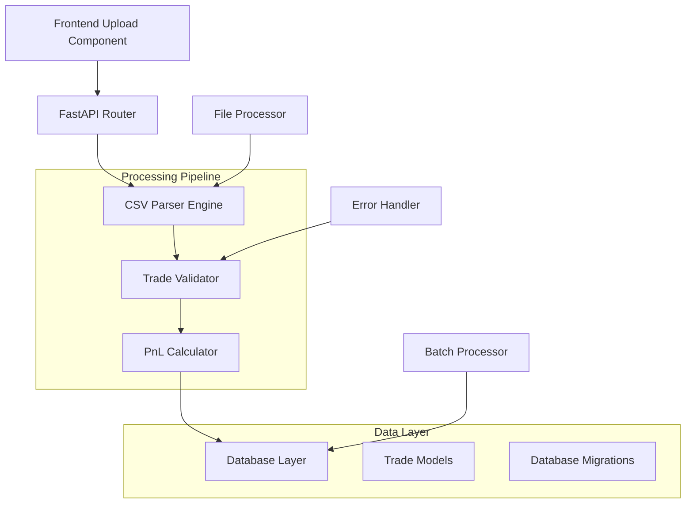

# Traderra CSV Processing - Developer Integration Guide

## Overview

This guide provides comprehensive documentation for developers integrating with or extending the Traderra CSV processing system. It includes API specifications, code examples, integration patterns, and best practices for handling financial data processing.

## Table of Contents

1. [Architecture Overview](#architecture-overview)
2. [API Reference](#api-reference)
3. [Core Components](#core-components)
4. [Integration Examples](#integration-examples)
5. [Testing Framework](#testing-framework)
6. [Extension Patterns](#extension-patterns)
7. [Performance Optimization](#performance-optimization)
8. [Security Considerations](#security-considerations)

## Architecture Overview

### System Components



### Technology Stack

- **Backend**: FastAPI (Python 3.9+)
- **Database**: PostgreSQL with AsyncPG
- **Validation**: Pydantic models
- **Testing**: Pytest with async support
- **File Processing**: Python csv module with encoding detection
- **Type Safety**: Full type hints throughout

## API Reference

### Base Configuration

```python
# Configuration
BASE_URL = "https://api.traderra.com/v1"
UPLOAD_ENDPOINT = f"{BASE_URL}/trades/upload-csv"
VALIDATE_ENDPOINT = f"{BASE_URL}/trades/validate-csv"
```

### Authentication

All API calls require authentication via JWT token:

```python
headers = {
    "Authorization": f"Bearer {jwt_token}",
    "Content-Type": "multipart/form-data"
}
```

### Upload CSV Endpoint

#### Request

```http
POST /api/v1/trades/upload-csv
Content-Type: multipart/form-data
Authorization: Bearer {token}
```

**Parameters:**
- `file`: CSV file (required, max 50MB)
- `format`: CSV format hint (optional: 'tradervue', 'td_ameritrade', 'ib')
- `dry_run`: Boolean, validate only without storing (optional, default: false)

**Python Example:**
```python
import aiohttp
import aiofiles

async def upload_csv(file_path: str, token: str) -> dict:
    """Upload CSV file to Traderra API"""

    async with aiohttp.ClientSession() as session:
        async with aiofiles.open(file_path, 'rb') as file:
            data = aiohttp.FormData()
            data.add_field('file',
                          file,
                          filename=file_path.split('/')[-1],
                          content_type='text/csv')

            headers = {"Authorization": f"Bearer {token}"}

            async with session.post(
                UPLOAD_ENDPOINT,
                data=data,
                headers=headers
            ) as response:
                return await response.json()

# Usage example
result = await upload_csv('trades.csv', 'your_jwt_token')
print(f"Processed {result['valid_trades']} trades successfully")
```

#### Response

```json
{
    "success": true,
    "upload_id": "upload_123456789",
    "total_processed": 1760,
    "valid_trades": 1760,
    "validation_errors": [],
    "processing_time": 12.5,
    "summary": {
        "format_detected": "tradervue",
        "trades_by_type": {
            "stocks": 1520,
            "options": 240
        },
        "date_range": {
            "earliest": "2024-01-01",
            "latest": "2024-03-15"
        }
    },
    "performance_metrics": {
        "parsing_time": 2.3,
        "validation_time": 4.1,
        "storage_time": 6.1
    }
}
```

**Error Response:**
```json
{
    "success": false,
    "error": "validation_failed",
    "message": "Invalid file format or corrupted data",
    "details": {
        "file_size": 52428800,
        "max_allowed": 50000000,
        "error_code": "FILE_TOO_LARGE"
    },
    "validation_errors": [
        {
            "row": 15,
            "column": "price",
            "error": "Invalid decimal format",
            "value": "invalid_price",
            "suggestion": "Use decimal format like 123.45"
        }
    ]
}
```

### Validation Preview Endpoint

#### Request

```http
POST /api/v1/trades/validate-csv
Content-Type: multipart/form-data
Authorization: Bearer {token}
```

**Python Example:**
```python
async def validate_csv_preview(file_path: str, token: str) -> dict:
    """Preview CSV validation without storing data"""

    async with aiohttp.ClientSession() as session:
        async with aiofiles.open(file_path, 'rb') as file:
            data = aiohttp.FormData()
            data.add_field('file', file, filename='preview.csv')

            headers = {"Authorization": f"Bearer {token}"}

            async with session.post(
                VALIDATE_ENDPOINT,
                data=data,
                headers=headers
            ) as response:
                return await response.json()

# Usage
validation_result = await validate_csv_preview('trades.csv', token)
if validation_result['success']:
    print(f"File valid: {validation_result['valid_count']} good trades")
else:
    print(f"Issues found: {validation_result['error_count']} errors")
```

#### Response

```json
{
    "success": true,
    "format_detected": "tradervue",
    "total_rows": 1787,
    "valid_count": 1760,
    "error_count": 27,
    "sample_errors": [
        {
            "row": 15,
            "issue": "missing_required_field",
            "field": "symbol",
            "severity": "critical"
        }
    ],
    "recommendations": [
        "Consider splitting large file for better performance",
        "Review rows with missing symbols before upload"
    ],
    "estimated_processing_time": 15.2
}
```

## Core Components

### CSV Parser Engine

The CSV parser is the core component responsible for processing uploaded files.

#### Basic Usage

```python
from traderra.csv_processing import TradeCSVParser
from traderra.models import ParseResult

async def process_csv_file(file_content: bytes) -> ParseResult:
    """Process CSV file content and return parsed trades"""

    parser = TradeCSVParser()
    result = await parser.parse_csv(file_content)

    return result

# Example usage
with open('trades.csv', 'rb') as f:
    content = f.read()

result = await process_csv_file(content)
print(f"Processed {len(result.valid_trades)} trades")
```

#### Advanced Configuration

```python
from traderra.csv_processing import TradeCSVParser, ParserConfig

# Custom parser configuration
config = ParserConfig(
    max_file_size=100 * 1024 * 1024,  # 100MB
    batch_size=1000,
    encoding_detection=True,
    error_recovery=True,
    strict_validation=False,
    supported_formats=['tradervue', 'td_ameritrade', 'ib', 'generic']
)

parser = TradeCSVParser(config)

# Parse with custom options
result = await parser.parse_csv(
    file_content,
    format_hint='tradervue',
    validate_only=True,
    max_errors=100
)
```

#### Custom Format Support

```python
from traderra.csv_processing import BaseCSVFormat

class CustomBrokerFormat(BaseCSVFormat):
    """Custom format for specific broker CSV exports"""

    format_name = "custom_broker"

    # Define required columns and their mappings
    column_mappings = {
        'symbol': ['Symbol', 'Instrument', 'Stock'],
        'action': ['Action', 'Side', 'Buy/Sell'],
        'quantity': ['Qty', 'Quantity', 'Shares'],
        'price': ['Price', 'Fill Price', 'Execution Price'],
        'date': ['Date', 'Trade Date', 'Execution Date']
    }

    def detect_format(self, headers: List[str]) -> bool:
        """Detect if CSV matches this format"""
        required_patterns = ['Symbol', 'Action', 'Fill Price']
        return all(any(pattern in header for header in headers)
                  for pattern in required_patterns)

    def parse_row(self, row: dict) -> Trade:
        """Parse a single row into Trade object"""
        return Trade(
            symbol=self.clean_symbol(row.get('Symbol')),
            action=self.normalize_action(row.get('Action')),
            quantity=int(row.get('Qty', 0)),
            entry_price=Decimal(str(row.get('Fill Price', 0))),
            entry_date=self.parse_date(row.get('Trade Date'))
        )

# Register custom format
parser.register_format(CustomBrokerFormat())
```

### Trade Validation System

#### Core Validator

```python
from traderra.validation import TradeValidator, ValidationRule

class OptionsTradeValidator(TradeValidator):
    """Specialized validator for options trades"""

    def __init__(self):
        super().__init__()
        self.add_rule(RequiredFieldsRule())
        self.add_rule(OptionsDataRule())
        self.add_rule(PriceRangeRule())
        self.add_rule(DateValidityRule())

    async def validate_trade(self, trade: Trade) -> ValidationResult:
        """Validate a single trade against all rules"""

        result = ValidationResult(trade_id=trade.id)

        for rule in self.rules:
            rule_result = await rule.validate(trade)
            result.add_rule_result(rule_result)

            if rule_result.severity == 'critical' and not rule_result.passed:
                result.overall_status = 'failed'
                break

        return result

# Custom validation rule example
class PriceRangeRule(ValidationRule):
    """Validate that prices are within reasonable ranges"""

    def __init__(self, min_price: Decimal = Decimal('0.01'),
                 max_price: Decimal = Decimal('10000.00')):
        self.min_price = min_price
        self.max_price = max_price

    async def validate(self, trade: Trade) -> RuleResult:
        """Check if trade prices are within acceptable range"""

        if trade.entry_price < self.min_price:
            return RuleResult(
                rule_name="price_range",
                passed=False,
                severity="critical",
                message=f"Entry price {trade.entry_price} below minimum {self.min_price}"
            )

        if trade.entry_price > self.max_price:
            return RuleResult(
                rule_name="price_range",
                passed=False,
                severity="warning",
                message=f"Entry price {trade.entry_price} unusually high"
            )

        return RuleResult(rule_name="price_range", passed=True)
```

### PnL Calculator

#### Basic Usage

```python
from traderra.calculations import PnLCalculator
from decimal import Decimal

calculator = PnLCalculator()

# Calculate PnL for a completed trade
trade = Trade(
    symbol="AAPL",
    action="BUY",
    quantity=100,
    entry_price=Decimal('150.00'),
    exit_price=Decimal('155.00'),
    commission=Decimal('1.50'),
    sec_fee=Decimal('0.22'),
    taf_fee=Decimal('0.08')
)

pnl = calculator.calculate_trade_pnl(trade)
print(f"Trade PnL: ${pnl}")  # Trade PnL: $498.20
```

#### Advanced Calculations

```python
class AdvancedPnLCalculator(PnLCalculator):
    """Enhanced PnL calculator with additional features"""

    def calculate_options_pnl(self, trade: Trade) -> PnLResult:
        """Calculate PnL for options trades with multiplier"""

        if not self.is_options_trade(trade):
            return self.calculate_trade_pnl(trade)

        # Options contracts have 100x multiplier
        multiplier = 100

        # Calculate gross PnL
        if trade.action.upper() in ['BUY', 'BTO']:
            price_diff = trade.exit_price - trade.entry_price
        else:  # SELL, STO
            price_diff = trade.entry_price - trade.exit_price

        gross_pnl = price_diff * trade.quantity * multiplier

        # Subtract all commission components
        total_commission = self.calculate_total_commissions(trade)
        net_pnl = gross_pnl - total_commission

        return PnLResult(
            gross_pnl=gross_pnl,
            total_commission=total_commission,
            net_pnl=net_pnl,
            multiplier_applied=multiplier
        )

    def calculate_portfolio_metrics(self, trades: List[Trade]) -> PortfolioMetrics:
        """Calculate comprehensive portfolio metrics"""

        total_pnl = Decimal('0')
        total_commission = Decimal('0')
        winning_trades = 0
        losing_trades = 0

        for trade in trades:
            pnl_result = self.calculate_trade_pnl(trade)
            total_pnl += pnl_result.net_pnl
            total_commission += pnl_result.total_commission

            if pnl_result.net_pnl > 0:
                winning_trades += 1
            elif pnl_result.net_pnl < 0:
                losing_trades += 1

        win_rate = winning_trades / len(trades) if trades else 0

        return PortfolioMetrics(
            total_pnl=total_pnl,
            total_commission=total_commission,
            total_trades=len(trades),
            winning_trades=winning_trades,
            losing_trades=losing_trades,
            win_rate=win_rate
        )
```

## Integration Examples

### Frontend Integration

#### React Component Example

```typescript
// TradeUpload.tsx
import React, { useState } from 'react';
import { uploadCSV, validateCSV } from '../services/tradeApi';

interface UploadResult {
  success: boolean;
  validTrades: number;
  totalProcessed: number;
  errors: ValidationError[];
}

export const TradeUploadComponent: React.FC = () => {
  const [file, setFile] = useState<File | null>(null);
  const [uploadResult, setUploadResult] = useState<UploadResult | null>(null);
  const [isUploading, setIsUploading] = useState(false);
  const [validationPreview, setValidationPreview] = useState(null);

  const handleFileSelect = (event: React.ChangeEvent<HTMLInputElement>) => {
    const selectedFile = event.target.files?.[0];
    if (selectedFile) {
      setFile(selectedFile);
      // Auto-validate on file selection
      validateFile(selectedFile);
    }
  };

  const validateFile = async (file: File) => {
    try {
      const preview = await validateCSV(file);
      setValidationPreview(preview);
    } catch (error) {
      console.error('Validation failed:', error);
    }
  };

  const handleUpload = async () => {
    if (!file) return;

    setIsUploading(true);
    try {
      const result = await uploadCSV(file);
      setUploadResult(result);
    } catch (error) {
      console.error('Upload failed:', error);
    } finally {
      setIsUploading(false);
    }
  };

  return (
    <div className="trade-upload">
      <div className="upload-section">
        <input
          type="file"
          accept=".csv"
          onChange={handleFileSelect}
          disabled={isUploading}
        />

        {validationPreview && (
          <div className="validation-preview">
            <h3>File Preview</h3>
            <p>Format: {validationPreview.formatDetected}</p>
            <p>Valid trades: {validationPreview.validCount}</p>
            <p>Errors: {validationPreview.errorCount}</p>

            {validationPreview.sampleErrors.length > 0 && (
              <div className="sample-errors">
                <h4>Sample Issues:</h4>
                {validationPreview.sampleErrors.map((error, index) => (
                  <div key={index} className="error-item">
                    Row {error.row}: {error.issue} ({error.field})
                  </div>
                ))}
              </div>
            )}
          </div>
        )}

        <button
          onClick={handleUpload}
          disabled={!file || isUploading}
          className="upload-button"
        >
          {isUploading ? 'Uploading...' : 'Upload CSV'}
        </button>
      </div>

      {uploadResult && (
        <div className="upload-results">
          <h3>Upload Complete</h3>
          <div className="results-summary">
            <p>✅ {uploadResult.validTrades} trades imported successfully</p>
            <p>📊 {uploadResult.totalProcessed} total rows processed</p>

            {uploadResult.errors.length > 0 && (
              <div className="errors-section">
                <h4>Issues Found:</h4>
                {uploadResult.errors.map((error, index) => (
                  <div key={index} className="error-detail">
                    Row {error.row}: {error.message}
                  </div>
                ))}
              </div>
            )}
          </div>
        </div>
      )}
    </div>
  );
};
```

#### API Service Layer

```typescript
// services/tradeApi.ts
class TradeAPIService {
  private baseURL = process.env.REACT_APP_API_URL;
  private token = localStorage.getItem('authToken');

  async uploadCSV(file: File): Promise<UploadResult> {
    const formData = new FormData();
    formData.append('file', file);

    const response = await fetch(`${this.baseURL}/trades/upload-csv`, {
      method: 'POST',
      headers: {
        'Authorization': `Bearer ${this.token}`,
      },
      body: formData,
    });

    if (!response.ok) {
      throw new Error(`Upload failed: ${response.statusText}`);
    }

    return response.json();
  }

  async validateCSV(file: File): Promise<ValidationResult> {
    const formData = new FormData();
    formData.append('file', file);

    const response = await fetch(`${this.baseURL}/trades/validate-csv`, {
      method: 'POST',
      headers: {
        'Authorization': `Bearer ${this.token}`,
      },
      body: formData,
    });

    return response.json();
  }

  async getUploadProgress(uploadId: string): Promise<ProgressUpdate> {
    const response = await fetch(
      `${this.baseURL}/trades/upload-progress/${uploadId}`,
      {
        headers: {
          'Authorization': `Bearer ${this.token}`,
        },
      }
    );

    return response.json();
  }
}

export const tradeAPI = new TradeAPIService();
export const { uploadCSV, validateCSV } = tradeAPI;
```

### Backend Integration

#### FastAPI Route Implementation

```python
# api/routes/trades.py
from fastapi import APIRouter, Depends, File, UploadFile, HTTPException
from fastapi.responses import JSONResponse
from sqlalchemy.ext.asyncio import AsyncSession

from ..dependencies import get_current_user, get_db
from ..services.csv_processing import CSVProcessingService
from ..models.trade import Trade
from ..schemas.upload import UploadResponse, ValidationResponse

router = APIRouter(prefix="/trades", tags=["trades"])

@router.post("/upload-csv", response_model=UploadResponse)
async def upload_csv(
    file: UploadFile = File(...),
    format_hint: Optional[str] = None,
    dry_run: bool = False,
    current_user: User = Depends(get_current_user),
    db: AsyncSession = Depends(get_db)
):
    """
    Upload and process CSV file with comprehensive validation
    """

    # Validate file
    if not file.filename.endswith('.csv'):
        raise HTTPException(
            status_code=400,
            detail="Only CSV files are allowed"
        )

    if file.size > 50 * 1024 * 1024:  # 50MB limit
        raise HTTPException(
            status_code=400,
            detail="File size exceeds 50MB limit"
        )

    try:
        # Initialize processing service
        processing_service = CSVProcessingService(db, current_user)

        # Read file content
        file_content = await file.read()

        # Process the upload
        result = await processing_service.process_upload(
            file_content=file_content,
            filename=file.filename,
            format_hint=format_hint,
            dry_run=dry_run
        )

        return UploadResponse(
            success=True,
            upload_id=result.upload_id,
            total_processed=result.total_processed,
            valid_trades=result.valid_trades,
            validation_errors=result.validation_errors,
            processing_time=result.processing_time,
            summary=result.summary
        )

    except Exception as e:
        logger.error(f"CSV upload failed for user {current_user.id}: {str(e)}")
        raise HTTPException(
            status_code=500,
            detail=f"Processing failed: {str(e)}"
        )

@router.post("/validate-csv", response_model=ValidationResponse)
async def validate_csv(
    file: UploadFile = File(...),
    current_user: User = Depends(get_current_user)
):
    """
    Validate CSV file without storing data
    """

    file_content = await file.read()

    processing_service = CSVProcessingService(None, current_user)
    validation_result = await processing_service.validate_only(
        file_content,
        file.filename
    )

    return ValidationResponse(**validation_result.dict())

@router.get("/upload-progress/{upload_id}")
async def get_upload_progress(
    upload_id: str,
    current_user: User = Depends(get_current_user),
    db: AsyncSession = Depends(get_db)
):
    """
    Get real-time upload progress for long-running operations
    """

    progress = await get_processing_progress(db, upload_id, current_user.id)

    if not progress:
        raise HTTPException(status_code=404, detail="Upload not found")

    return {
        "upload_id": upload_id,
        "status": progress.status,
        "processed_rows": progress.processed_rows,
        "total_rows": progress.total_rows,
        "current_operation": progress.current_operation,
        "estimated_completion": progress.estimated_completion
    }
```

#### Service Layer Implementation

```python
# services/csv_processing.py
from typing import Optional, List
import asyncio
from decimal import Decimal

from ..models.trade import Trade
from ..csv_processing import TradeCSVParser
from ..calculations import PnLCalculator
from ..validation import TradeValidator

class CSVProcessingService:
    """
    High-level service for CSV processing operations
    """

    def __init__(self, db: AsyncSession, user: User):
        self.db = db
        self.user = user
        self.parser = TradeCSVParser()
        self.validator = TradeValidator()
        self.calculator = PnLCalculator()

    async def process_upload(
        self,
        file_content: bytes,
        filename: str,
        format_hint: Optional[str] = None,
        dry_run: bool = False
    ) -> ProcessingResult:
        """
        Complete CSV processing pipeline
        """

        start_time = time.time()

        # 1. Parse CSV content
        parse_result = await self.parser.parse_csv(
            file_content,
            format_hint=format_hint
        )

        # 2. Validate trades
        validated_trades = []
        validation_errors = []

        for trade_data in parse_result.valid_trades:
            validation_result = await self.validator.validate_trade(trade_data)

            if validation_result.is_valid:
                # Calculate PnL
                trade_data.pnl = self.calculator.calculate_trade_pnl(trade_data)
                validated_trades.append(trade_data)
            else:
                validation_errors.extend(validation_result.errors)

        # 3. Store trades (if not dry run)
        stored_trades = []
        if not dry_run and validated_trades:
            stored_trades = await self.store_trades(validated_trades)

        processing_time = time.time() - start_time

        return ProcessingResult(
            upload_id=generate_upload_id(),
            total_processed=len(parse_result.raw_data),
            valid_trades=len(stored_trades) if not dry_run else len(validated_trades),
            validation_errors=validation_errors,
            processing_time=processing_time,
            summary=self._generate_summary(validated_trades)
        )

    async def store_trades(self, trades: List[Trade]) -> List[Trade]:
        """
        Efficiently store trades in database
        """

        batch_size = 1000
        stored_trades = []

        for i in range(0, len(trades), batch_size):
            batch = trades[i:i + batch_size]

            # Prepare trade objects for database
            trade_objects = [
                Trade(
                    user_id=self.user.id,
                    **trade.dict()
                ) for trade in batch
            ]

            # Batch insert
            async with self.db.begin():
                self.db.add_all(trade_objects)
                await self.db.flush()

                stored_trades.extend(trade_objects)

        await self.db.commit()
        return stored_trades

    def _generate_summary(self, trades: List[Trade]) -> dict:
        """Generate processing summary statistics"""

        summary = {
            "trades_by_type": {"stocks": 0, "options": 0},
            "date_range": {"earliest": None, "latest": None},
            "total_pnl": Decimal('0'),
            "total_commission": Decimal('0')
        }

        for trade in trades:
            # Categorize trade type
            if self._is_options_trade(trade):
                summary["trades_by_type"]["options"] += 1
            else:
                summary["trades_by_type"]["stocks"] += 1

            # Update date range
            trade_date = trade.entry_date.date()
            if not summary["date_range"]["earliest"] or trade_date < summary["date_range"]["earliest"]:
                summary["date_range"]["earliest"] = trade_date
            if not summary["date_range"]["latest"] or trade_date > summary["date_range"]["latest"]:
                summary["date_range"]["latest"] = trade_date

            # Aggregate financials
            if trade.pnl:
                summary["total_pnl"] += trade.pnl
            if trade.commission:
                summary["total_commission"] += trade.commission

        return summary
```

## Testing Framework

### Unit Tests

```python
# tests/test_csv_parser.py
import pytest
from decimal import Decimal
from io import StringIO

from traderra.csv_processing import TradeCSVParser
from traderra.models import Trade

class TestCSVParser:

    @pytest.fixture
    def parser(self):
        return TradeCSVParser()

    @pytest.fixture
    def sample_tradervue_csv(self):
        """Sample TradervUE CSV data"""
        return """Date,Symbol,Side,Quantity,Price,Commissions,Net P&L
2024-01-15,AAPL,BUY,100,150.25,1.50,
2024-01-16,AAPL,SELL,100,155.75,1.50,498.50
2024-02-01,TSLA240315C200,BUY,1,15.50,1.25,
2024-02-02,TSLA240315C200,SELL,1,18.75,1.25,320.00"""

    @pytest.mark.asyncio
    async def test_tradervue_format_detection(self, parser, sample_tradervue_csv):
        """Test automatic format detection for TradervUE files"""

        result = await parser.parse_csv(sample_tradervue_csv.encode('utf-8'))

        assert result.format_detected == "tradervue"
        assert len(result.valid_trades) == 4
        assert result.validation_errors == []

    @pytest.mark.asyncio
    async def test_pnl_calculation_accuracy(self, parser, sample_tradervue_csv):
        """Test that PnL calculations match expected values"""

        result = await parser.parse_csv(sample_tradervue_csv.encode('utf-8'))

        # Find the AAPL sell trade
        aapl_sell = next(
            trade for trade in result.valid_trades
            if trade.symbol == "AAPL" and trade.action == "SELL"
        )

        # Verify PnL calculation
        # (155.75 - 150.25) * 100 - (1.50 + 1.50) = 550 - 3 = 547
        # But the CSV shows net P&L of 498.50, so our calculation should match
        expected_pnl = Decimal('498.50')
        assert abs(aapl_sell.pnl - expected_pnl) < Decimal('0.01')

    @pytest.mark.asyncio
    async def test_options_trade_parsing(self, parser, sample_tradervue_csv):
        """Test options trade parsing and validation"""

        result = await parser.parse_csv(sample_tradervue_csv.encode('utf-8'))

        # Find options trades
        options_trades = [
            trade for trade in result.valid_trades
            if "240315C" in trade.symbol
        ]

        assert len(options_trades) == 2

        options_buy = next(
            trade for trade in options_trades
            if trade.action == "BUY"
        )

        assert options_buy.symbol == "TSLA240315C200"
        assert options_buy.strike_price == Decimal('200')
        assert options_buy.option_type == "CALL"
        assert options_buy.expiry_date.strftime('%Y-%m-%d') == "2024-03-15"

    @pytest.mark.asyncio
    async def test_validation_error_handling(self, parser):
        """Test handling of invalid data"""

        invalid_csv = """Date,Symbol,Side,Quantity,Price
2024-01-15,,BUY,100,150.25
2024-01-16,AAPL,INVALID_ACTION,abc,not_a_price"""

        result = await parser.parse_csv(invalid_csv.encode('utf-8'))

        assert len(result.validation_errors) == 2
        assert result.validation_errors[0].field == "symbol"
        assert result.validation_errors[1].field == "action"

    @pytest.mark.asyncio
    async def test_large_file_performance(self, parser):
        """Test performance with large CSV files"""

        # Generate large CSV content
        header = "Date,Symbol,Side,Quantity,Price,Commissions\n"
        large_csv = header

        for i in range(10000):
            large_csv += f"2024-01-{(i % 30) + 1:02d},STOCK{i % 100},BUY,100,{100 + (i % 50)}.25,1.50\n"

        start_time = time.time()
        result = await parser.parse_csv(large_csv.encode('utf-8'))
        processing_time = time.time() - start_time

        assert len(result.valid_trades) == 10000
        assert processing_time < 30  # Should process 10k trades in under 30 seconds
        assert result.validation_errors == []
```

### Integration Tests

```python
# tests/test_upload_integration.py
import pytest
from httpx import AsyncClient
from sqlalchemy.ext.asyncio import AsyncSession

from traderra.main import app
from traderra.models.trade import Trade

@pytest.mark.asyncio
class TestUploadIntegration:

    async def test_complete_upload_flow(
        self,
        async_client: AsyncClient,
        test_user_token: str,
        test_db: AsyncSession
    ):
        """Test complete upload flow from API to database"""

        # Prepare test CSV file
        csv_content = """Date,Symbol,Side,Quantity,Price,Commissions
2024-01-15,AAPL,BUY,100,150.25,1.50
2024-01-16,AAPL,SELL,100,155.75,1.50"""

        # Create file upload
        files = {"file": ("test_trades.csv", csv_content, "text/csv")}
        headers = {"Authorization": f"Bearer {test_user_token}"}

        # Upload CSV
        response = await async_client.post(
            "/api/v1/trades/upload-csv",
            files=files,
            headers=headers
        )

        assert response.status_code == 200
        result = response.json()

        assert result["success"] == True
        assert result["valid_trades"] == 2
        assert result["total_processed"] == 2

        # Verify data was stored in database
        stored_trades = await test_db.execute(
            select(Trade).where(Trade.user_id == test_user.id)
        )
        trades = stored_trades.scalars().all()

        assert len(trades) == 2

        # Verify PnL calculation
        sell_trade = next(trade for trade in trades if trade.action == "SELL")
        expected_pnl = (Decimal('155.75') - Decimal('150.25')) * 100 - Decimal('3.00')
        assert abs(sell_trade.pnl - expected_pnl) < Decimal('0.01')

    async def test_validation_error_handling(
        self,
        async_client: AsyncClient,
        test_user_token: str
    ):
        """Test API response to validation errors"""

        # CSV with validation errors
        csv_content = """Date,Symbol,Side,Quantity,Price
2024-01-15,,BUY,100,150.25
invalid_date,AAPL,INVALID_ACTION,abc,not_a_price"""

        files = {"file": ("invalid_trades.csv", csv_content, "text/csv")}
        headers = {"Authorization": f"Bearer {test_user_token}"}

        response = await async_client.post(
            "/api/v1/trades/upload-csv",
            files=files,
            headers=headers
        )

        assert response.status_code == 200
        result = response.json()

        assert result["success"] == True  # Partial success
        assert result["valid_trades"] == 0  # No valid trades
        assert len(result["validation_errors"]) > 0

        # Check error details
        errors = result["validation_errors"]
        assert any(error["field"] == "symbol" for error in errors)
        assert any(error["field"] == "action" for error in errors)

    async def test_file_size_limits(
        self,
        async_client: AsyncClient,
        test_user_token: str
    ):
        """Test file size validation"""

        # Create oversized file content
        large_content = "Date,Symbol,Side,Quantity,Price\n" * 2000000  # Very large

        files = {"file": ("large_file.csv", large_content, "text/csv")}
        headers = {"Authorization": f"Bearer {test_user_token}"}

        response = await async_client.post(
            "/api/v1/trades/upload-csv",
            files=files,
            headers=headers
        )

        assert response.status_code == 400
        assert "File size exceeds" in response.json()["detail"]
```

### Performance Tests

```python
# tests/test_performance.py
import pytest
import time
from memory_profiler import profile

class TestPerformance:

    @pytest.mark.performance
    async def test_parsing_speed_benchmarks(self):
        """Benchmark CSV parsing performance"""

        test_cases = [
            (100, "small_file"),
            (1000, "medium_file"),
            (10000, "large_file"),
            (50000, "extra_large_file")
        ]

        parser = TradeCSVParser()

        for trade_count, test_name in test_cases:
            # Generate test CSV
            csv_content = self._generate_test_csv(trade_count)

            # Measure parsing time
            start_time = time.time()
            result = await parser.parse_csv(csv_content.encode('utf-8'))
            parsing_time = time.time() - start_time

            # Assert performance benchmarks
            if trade_count <= 1000:
                assert parsing_time < 5.0, f"{test_name} took {parsing_time:.2f}s, expected < 5s"
            elif trade_count <= 10000:
                assert parsing_time < 30.0, f"{test_name} took {parsing_time:.2f}s, expected < 30s"
            else:
                assert parsing_time < 120.0, f"{test_name} took {parsing_time:.2f}s, expected < 2min"

            print(f"{test_name}: {trade_count} trades in {parsing_time:.2f}s ({trade_count/parsing_time:.0f} trades/sec)")

    @profile
    async def test_memory_usage(self):
        """Test memory usage for large file processing"""

        # Generate large CSV file
        csv_content = self._generate_test_csv(50000)

        parser = TradeCSVParser()
        result = await parser.parse_csv(csv_content.encode('utf-8'))

        assert len(result.valid_trades) == 50000

        # Memory usage should be reasonable (monitored by @profile decorator)

    def _generate_test_csv(self, trade_count: int) -> str:
        """Generate test CSV with specified number of trades"""

        header = "Date,Symbol,Side,Quantity,Price,Commissions\n"
        content = header

        for i in range(trade_count):
            date = f"2024-{(i % 12) + 1:02d}-{(i % 28) + 1:02d}"
            symbol = f"STOCK{i % 100}"
            side = "BUY" if i % 2 == 0 else "SELL"
            quantity = 100 + (i % 900)
            price = 50 + (i % 200) + (i % 100) / 100
            commission = 1.50

            content += f"{date},{symbol},{side},{quantity},{price:.2f},{commission}\n"

        return content
```

## Extension Patterns

### Adding Custom Brokers

```python
# extensions/custom_broker_support.py
from traderra.csv_processing import BaseCSVFormat, TradeCSVParser

class CustomBrokerFormat(BaseCSVFormat):
    """Support for Custom Broker CSV exports"""

    format_name = "custom_broker"

    def detect_format(self, headers: List[str]) -> bool:
        required_headers = ["Trade Date", "Instrument", "Order Type", "Fill Qty", "Fill Price"]
        return all(header in headers for header in required_headers)

    def parse_row(self, row: dict) -> Trade:
        return Trade(
            symbol=self.normalize_symbol(row["Instrument"]),
            action=self.map_order_type(row["Order Type"]),
            quantity=int(row["Fill Qty"]),
            entry_price=Decimal(row["Fill Price"]),
            entry_date=self.parse_custom_date(row["Trade Date"]),
            commission=self.extract_commission(row)
        )

    def normalize_symbol(self, symbol: str) -> str:
        """Normalize broker-specific symbol format"""
        # Custom broker uses format "AAPL US" - extract just "AAPL"
        return symbol.split()[0]

    def map_order_type(self, order_type: str) -> str:
        """Map broker order types to standard actions"""
        mapping = {
            "Buy": "BUY",
            "Sell": "SELL",
            "Sell Short": "SHORT",
            "Buy to Cover": "COVER"
        }
        return mapping.get(order_type, order_type.upper())

# Register the custom format
def register_custom_formats():
    parser = TradeCSVParser()
    parser.register_format(CustomBrokerFormat())
    return parser
```

### Adding Custom Validation Rules

```python
# extensions/custom_validation.py
from traderra.validation import ValidationRule, RuleResult

class TradingHourValidationRule(ValidationRule):
    """Validate that trades occurred during market hours"""

    def __init__(self):
        self.market_open = time(9, 30)  # 9:30 AM
        self.market_close = time(16, 0)  # 4:00 PM

    async def validate(self, trade: Trade) -> RuleResult:
        trade_time = trade.entry_date.time()

        if not (self.market_open <= trade_time <= self.market_close):
            return RuleResult(
                rule_name="trading_hours",
                passed=False,
                severity="warning",
                message=f"Trade at {trade_time} outside normal market hours"
            )

        return RuleResult(rule_name="trading_hours", passed=True)

class MinimumTradeValueRule(ValidationRule):
    """Validate minimum trade value requirements"""

    def __init__(self, min_value: Decimal = Decimal('100.00')):
        self.min_value = min_value

    async def validate(self, trade: Trade) -> RuleResult:
        trade_value = trade.entry_price * trade.quantity

        if trade_value < self.min_value:
            return RuleResult(
                rule_name="minimum_value",
                passed=False,
                severity="warning",
                message=f"Trade value ${trade_value} below minimum ${self.min_value}"
            )

        return RuleResult(rule_name="minimum_value", passed=True)

# Usage: Add custom rules to validator
def create_enhanced_validator():
    validator = TradeValidator()
    validator.add_rule(TradingHourValidationRule())
    validator.add_rule(MinimumTradeValueRule(Decimal('50.00')))
    return validator
```

## Security Considerations

### Input Validation

```python
# security/input_validation.py
import re
from typing import List
from decimal import Decimal, InvalidOperation

class SecurityValidator:
    """Security-focused validation for CSV uploads"""

    ALLOWED_SYMBOLS = re.compile(r'^[A-Z]{1,5}(\d{6}[CP]\d+)?$')  # Stock symbols and options
    MAX_DECIMAL_PLACES = 4
    MAX_QUANTITY = 1000000
    MAX_PRICE = Decimal('100000.00')

    @classmethod
    def validate_symbol(cls, symbol: str) -> bool:
        """Validate symbol format and prevent injection"""
        if not symbol or len(symbol) > 20:
            return False

        # Remove any potential SQL injection characters
        dangerous_chars = ["'", '"', ';', '--', '/*', '*/', 'xp_', 'sp_']
        if any(char in symbol.lower() for char in dangerous_chars):
            return False

        return bool(cls.ALLOWED_SYMBOLS.match(symbol.upper()))

    @classmethod
    def validate_decimal(cls, value: str, field_name: str) -> Decimal:
        """Safely parse decimal values"""
        try:
            decimal_value = Decimal(str(value).strip())

            # Check for reasonable bounds
            if field_name == "price" and decimal_value > cls.MAX_PRICE:
                raise ValueError(f"Price {decimal_value} exceeds maximum {cls.MAX_PRICE}")

            if field_name == "quantity" and decimal_value > cls.MAX_QUANTITY:
                raise ValueError(f"Quantity {decimal_value} exceeds maximum {cls.MAX_QUANTITY}")

            # Check decimal places
            if decimal_value.as_tuple().exponent < -cls.MAX_DECIMAL_PLACES:
                raise ValueError(f"Too many decimal places in {field_name}")

            return decimal_value

        except (InvalidOperation, ValueError) as e:
            raise ValueError(f"Invalid {field_name}: {value}")

    @classmethod
    def sanitize_text_input(cls, text: str) -> str:
        """Sanitize text input to prevent injection attacks"""
        if not text:
            return ""

        # Remove potential script tags and SQL injection attempts
        text = re.sub(r'<script.*?</script>', '', text, flags=re.IGNORECASE | re.DOTALL)
        text = re.sub(r'javascript:', '', text, flags=re.IGNORECASE)
        text = re.sub(r'on\w+\s*=', '', text, flags=re.IGNORECASE)

        # Limit length
        return text[:500]
```

### File Upload Security

```python
# security/file_security.py
import hashlib
import magic
from typing import Optional

class FileSecurityValidator:
    """Security validation for uploaded files"""

    ALLOWED_MIME_TYPES = ['text/csv', 'text/plain', 'application/csv']
    MAX_FILE_SIZE = 50 * 1024 * 1024  # 50MB
    VIRUS_SCAN_ENABLED = True

    @classmethod
    async def validate_file_security(cls, file_content: bytes, filename: str) -> dict:
        """Comprehensive file security validation"""

        validation_result = {
            "secure": True,
            "issues": [],
            "file_hash": None
        }

        # 1. File size check
        if len(file_content) > cls.MAX_FILE_SIZE:
            validation_result["secure"] = False
            validation_result["issues"].append(f"File size {len(file_content)} exceeds limit {cls.MAX_FILE_SIZE}")

        # 2. MIME type validation
        mime_type = magic.from_buffer(file_content, mime=True)
        if mime_type not in cls.ALLOWED_MIME_TYPES:
            validation_result["secure"] = False
            validation_result["issues"].append(f"Invalid MIME type: {mime_type}")

        # 3. File extension validation
        if not filename.lower().endswith('.csv'):
            validation_result["secure"] = False
            validation_result["issues"].append("Invalid file extension")

        # 4. Content validation (basic)
        try:
            decoded_content = file_content.decode('utf-8', errors='strict')

            # Check for suspicious patterns
            suspicious_patterns = [
                r'<script',
                r'javascript:',
                r'vbscript:',
                r'on\w+\s*=',
                r'eval\s*\(',
                r'exec\s*\('
            ]

            for pattern in suspicious_patterns:
                if re.search(pattern, decoded_content, re.IGNORECASE):
                    validation_result["secure"] = False
                    validation_result["issues"].append(f"Suspicious content pattern detected: {pattern}")

        except UnicodeDecodeError:
            validation_result["secure"] = False
            validation_result["issues"].append("File contains invalid characters")

        # 5. Generate file hash for integrity checking
        validation_result["file_hash"] = hashlib.sha256(file_content).hexdigest()

        return validation_result

    @classmethod
    async def scan_for_malware(cls, file_content: bytes) -> bool:
        """Scan file for malware (integration point for antivirus)"""

        if not cls.VIRUS_SCAN_ENABLED:
            return True

        # Integration point for antivirus scanning
        # This would typically call an external service
        # For now, just basic heuristic checks

        # Check for executable content
        executable_signatures = [
            b'\x4d\x5a',  # PE header
            b'\x7f\x45\x4c\x46',  # ELF header
            b'#!/bin/sh',  # Shell script
            b'#!/bin/bash'  # Bash script
        ]

        for signature in executable_signatures:
            if signature in file_content[:1024]:  # Check first 1KB
                return False

        return True
```

### Rate Limiting

```python
# security/rate_limiting.py
from fastapi import HTTPException, Request
from typing import Dict
import time
from collections import defaultdict

class RateLimiter:
    """Rate limiting for CSV upload endpoints"""

    def __init__(self):
        self.requests: Dict[str, List[float]] = defaultdict(list)
        self.upload_attempts: Dict[str, List[float]] = defaultdict(list)

    def check_rate_limit(self, client_ip: str, endpoint: str) -> bool:
        """Check if request is within rate limits"""

        current_time = time.time()

        # Different limits for different endpoints
        if endpoint == "upload":
            max_requests = 10  # 10 uploads per hour
            time_window = 3600  # 1 hour
            request_list = self.upload_attempts[client_ip]
        else:
            max_requests = 100  # 100 requests per hour
            time_window = 3600
            request_list = self.requests[client_ip]

        # Clean old requests
        request_list[:] = [req_time for req_time in request_list
                          if current_time - req_time < time_window]

        # Check limit
        if len(request_list) >= max_requests:
            return False

        # Add current request
        request_list.append(current_time)
        return True

# Middleware integration
async def rate_limit_middleware(request: Request, call_next):
    """Rate limiting middleware"""

    rate_limiter = RateLimiter()
    client_ip = request.client.host

    # Determine endpoint type
    endpoint_type = "upload" if "upload-csv" in str(request.url) else "general"

    if not rate_limiter.check_rate_limit(client_ip, endpoint_type):
        raise HTTPException(
            status_code=429,
            detail="Rate limit exceeded. Please try again later."
        )

    response = await call_next(request)
    return response
```

## Performance Optimization

### Caching Strategies

```python
# performance/caching.py
from functools import lru_cache
import redis
import pickle
from typing import Optional

class CSVProcessingCache:
    """Caching layer for CSV processing operations"""

    def __init__(self, redis_url: str = "redis://localhost:6379"):
        self.redis_client = redis.from_url(redis_url)
        self.cache_ttl = 3600  # 1 hour

    async def get_format_detection_cache(self, file_hash: str) -> Optional[str]:
        """Get cached format detection result"""

        cache_key = f"format_detection:{file_hash}"
        cached_result = self.redis_client.get(cache_key)

        if cached_result:
            return pickle.loads(cached_result)

        return None

    async def set_format_detection_cache(self, file_hash: str, format_type: str):
        """Cache format detection result"""

        cache_key = f"format_detection:{file_hash}"
        self.redis_client.setex(
            cache_key,
            self.cache_ttl,
            pickle.dumps(format_type)
        )

    @lru_cache(maxsize=1000)
    def get_symbol_validation_cache(self, symbol: str) -> bool:
        """Cache symbol validation results"""
        # This would typically call an external symbol validation service
        return self._validate_symbol_external(symbol)

    def _validate_symbol_external(self, symbol: str) -> bool:
        """External symbol validation (cached)"""
        # Placeholder for external API call
        return len(symbol) <= 10 and symbol.isalnum()
```

### Asynchronous Processing

```python
# performance/async_processing.py
import asyncio
from typing import List, Callable
from concurrent.futures import ThreadPoolExecutor

class AsyncCSVProcessor:
    """Asynchronous CSV processing for improved performance"""

    def __init__(self, max_workers: int = 4):
        self.max_workers = max_workers
        self.executor = ThreadPoolExecutor(max_workers=max_workers)

    async def process_csv_async(self, file_content: bytes) -> ProcessingResult:
        """Process CSV with async operations"""

        # 1. Parse CSV in thread pool (CPU intensive)
        loop = asyncio.get_event_loop()
        parse_result = await loop.run_in_executor(
            self.executor,
            self._parse_csv_sync,
            file_content
        )

        # 2. Validate trades concurrently
        validation_tasks = [
            self._validate_trade_async(trade)
            for trade in parse_result.trades
        ]

        validation_results = await asyncio.gather(*validation_tasks)

        # 3. Process results
        valid_trades = []
        validation_errors = []

        for trade, validation_result in zip(parse_result.trades, validation_results):
            if validation_result.is_valid:
                valid_trades.append(trade)
            else:
                validation_errors.extend(validation_result.errors)

        return ProcessingResult(
            valid_trades=valid_trades,
            validation_errors=validation_errors
        )

    def _parse_csv_sync(self, file_content: bytes) -> ParseResult:
        """Synchronous CSV parsing (runs in thread pool)"""
        # CPU-intensive parsing logic here
        pass

    async def _validate_trade_async(self, trade: Trade) -> ValidationResult:
        """Asynchronous trade validation"""
        # I/O intensive validation (database lookups, external APIs)
        pass

    async def batch_process_trades(
        self,
        trades: List[Trade],
        batch_size: int = 100
    ) -> List[ProcessingResult]:
        """Process trades in batches for better memory usage"""

        results = []

        for i in range(0, len(trades), batch_size):
            batch = trades[i:i + batch_size]

            # Process batch concurrently
            batch_tasks = [
                self._process_single_trade(trade)
                for trade in batch
            ]

            batch_results = await asyncio.gather(*batch_tasks)
            results.extend(batch_results)

            # Allow other coroutines to run
            await asyncio.sleep(0)

        return results
```

### Memory Optimization

```python
# performance/memory_optimization.py
import gc
from typing import Generator, Iterator

class MemoryEfficientCSVProcessor:
    """Memory-optimized CSV processing for large files"""

    def __init__(self, chunk_size: int = 1000):
        self.chunk_size = chunk_size

    def stream_process_csv(self, file_content: bytes) -> Generator[Trade, None, None]:
        """Stream processing to minimize memory usage"""

        csv_reader = csv.DictReader(
            io.StringIO(file_content.decode('utf-8'))
        )

        processed_count = 0

        for row in csv_reader:
            try:
                trade = self._parse_row(row)

                if self._validate_trade(trade):
                    yield trade

                processed_count += 1

                # Periodic garbage collection for large files
                if processed_count % self.chunk_size == 0:
                    gc.collect()

            except Exception as e:
                # Log error but continue processing
                logger.warning(f"Failed to process row {processed_count}: {e}")
                continue

    async def process_large_file(self, file_content: bytes) -> ProcessingResult:
        """Process large files with memory management"""

        valid_trades = []
        error_count = 0

        # Process in chunks to manage memory
        trade_stream = self.stream_process_csv(file_content)

        for trade in trade_stream:
            valid_trades.append(trade)

            # Flush to database periodically
            if len(valid_trades) >= self.chunk_size:
                await self._flush_trades_to_db(valid_trades)
                valid_trades.clear()  # Clear memory

        # Flush remaining trades
        if valid_trades:
            await self._flush_trades_to_db(valid_trades)

        return ProcessingResult(
            total_processed=len(valid_trades) + error_count,
            valid_trades=len(valid_trades),
            error_count=error_count
        )

    async def _flush_trades_to_db(self, trades: List[Trade]):
        """Efficiently flush trades to database"""
        # Batch insert implementation
        pass
```

## Conclusion

This developer guide provides comprehensive documentation for integrating with and extending the Traderra CSV processing system. The modular architecture allows for easy customization while maintaining security and performance standards.

### Key Integration Points

1. **API Endpoints**: RESTful endpoints for upload, validation, and progress tracking
2. **Core Components**: Extensible parser, validator, and calculator systems
3. **Security Layer**: Input validation, file security, and rate limiting
4. **Performance**: Async processing, caching, and memory optimization
5. **Testing**: Comprehensive test coverage for reliability

### Best Practices

1. **Always validate inputs** at multiple layers (client, API, processing)
2. **Implement proper error handling** with detailed error reporting
3. **Use async operations** for I/O intensive tasks
4. **Cache frequently accessed data** to improve performance
5. **Monitor and log** all operations for debugging and optimization
6. **Test with realistic data volumes** to ensure scalability

### Extension Guidelines

1. **Follow existing patterns** when adding new features
2. **Implement comprehensive tests** for all new functionality
3. **Document all public interfaces** and configuration options
4. **Consider backward compatibility** when making changes
5. **Security first** - validate all inputs and implement proper access controls

For additional support or questions about integration, please refer to the API documentation or contact the development team.

---

*This guide is maintained alongside the codebase and should be updated with any architectural changes or new features.*