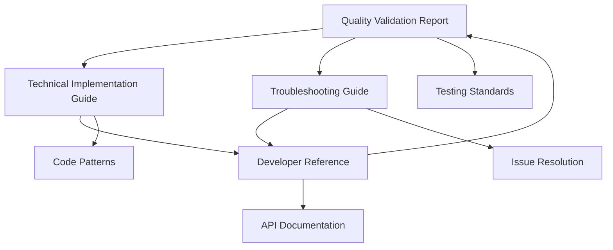

# Traderra Journal System Documentation Index

**Document Suite Version**: 1.0
**Creation Date**: October 25, 2025
**Documentation Team**: CE-Hub Documenter Specialist
**System**: Traderra Journal System - React/Next.js Frontend

## Documentation Overview

This comprehensive documentation suite captures the complete testing, validation, and implementation knowledge for the Traderra Journal System, following a critical functionality restoration project that resolved scrolling, JavaScript scoping, and layout hierarchy issues.

### Documentation Scope

**Project Context**: Critical bug fixes and system validation
**Testing Period**: October 2025
**System Score**: 91/100 - Production Approved
**Issues Resolved**: 3 critical, multiple performance improvements identified

## Document Collection

### 1. Quality Validation Report
**File**: `traderra-journal-system-quality-validation-report.md`
**Type**: Quality Assurance Documentation
**Audience**: QA Engineers, Technical Leadership, Stakeholders

**Content Overview**:
- Executive summary of testing outcomes
- Comprehensive issue analysis and resolution
- Systematic testing methodology and results
- Production readiness assessment and approval
- Performance benchmarks and quality metrics

**Key Sections**:
- Critical issues analysis (scrolling, JavaScript errors, CSS layout)
- Testing methodology (root cause analysis, implementation, validation)
- Quality metrics and production readiness assessment
- Minor improvements identified for future enhancement

**Knowledge Value**: Primary source for understanding systematic testing approach and quality validation standards.

### 2. Technical Implementation Guide
**File**: `traderra-journal-technical-implementation-guide.md`
**Type**: Technical Documentation
**Audience**: Senior Developers, Technical Architects, Implementation Teams

**Content Overview**:
- Detailed technical solutions for critical issues
- Code examples and implementation patterns
- Architecture analysis and improvement strategies
- Performance optimization techniques

**Key Sections**:
- CSS Flexbox scrolling implementation with code examples
- JavaScript module scoping solutions and best practices
- Component layout architecture and height management
- Advanced patterns (virtual scrolling, performance optimization)

**Knowledge Value**: Authoritative technical reference for implementing robust journal system functionality.

### 3. Troubleshooting Guide
**File**: `traderra-journal-troubleshooting-guide.md`
**Type**: Operations Documentation
**Audience**: Frontend Developers, DevOps Engineers, Support Teams

**Content Overview**:
- Systematic diagnostic procedures for common issues
- Quick reference for emergency fixes
- Detailed troubleshooting workflows
- Prevention strategies and monitoring

**Key Sections**:
- Flexbox scrolling issues (symptoms, causes, solutions)
- JavaScript scoping errors (diagnostic steps, fixes)
- Performance issues (profiling, optimization)
- Browser-specific compatibility solutions

**Knowledge Value**: Essential operational knowledge for maintaining system reliability and resolving issues efficiently.

### 4. Developer Reference Documentation
**File**: `traderra-journal-developer-reference.md`
**Type**: API/Development Documentation
**Audience**: Frontend Developers, New Team Members, Maintainers

**Content Overview**:
- Complete API reference for components and utilities
- Development guidelines and coding standards
- Testing strategies and security guidelines
- Deployment and contribution workflows

**Key Sections**:
- Component API reference (JournalPage, EntryCard, etc.)
- TypeScript interfaces and utility functions
- Performance guidelines and optimization strategies
- Testing standards and accessibility requirements

**Knowledge Value**: Comprehensive developer resource for ongoing development and maintenance.

## Knowledge Graph Integration

### Metadata Structure

Each document includes comprehensive metadata optimized for Archon knowledge graph ingestion:

```yaml
document_metadata:
  domain: "frontend-development"
  system: "traderra-journal"
  technology_stack: ["react", "nextjs", "typescript", "tailwindcss"]
  knowledge_type: "technical"
  complexity_level: "advanced"
  tags:
    - "testing-validation"
    - "bug-fixes"
    - "scrolling-issues"
    - "javascript-scoping"
    - "css-flexbox"
    - "performance-optimization"
  content_categories:
    - "quality-assurance"
    - "technical-implementation"
    - "troubleshooting"
    - "developer-reference"
```

### Search Optimization

**Primary Keywords**: journal system, scrolling functionality, flexbox layout, JavaScript scoping, React components
**Secondary Keywords**: quality validation, testing methodology, performance optimization, troubleshooting guide
**Context Keywords**: Next.js, TypeScript, Tailwind CSS, frontend development, user experience

### Cross-Reference Structure



## Usage Guidelines

### Document Selection by Role

**Quality Assurance Engineers**:
1. Start with Quality Validation Report
2. Reference Troubleshooting Guide for issue investigation
3. Use Technical Implementation Guide for deep understanding

**Frontend Developers**:
1. Begin with Developer Reference Documentation
2. Use Technical Implementation Guide for complex features
3. Reference Troubleshooting Guide for debugging

**Technical Leadership**:
1. Review Quality Validation Report for project status
2. Examine Technical Implementation Guide for architecture decisions
3. Use documentation suite for team training and standards

**New Team Members**:
1. Start with Developer Reference for system overview
2. Study Technical Implementation Guide for architecture understanding
3. Keep Troubleshooting Guide accessible for common issues

### Knowledge Discovery Paths

**Problem-Solving Path**:
Issue Encountered → Troubleshooting Guide → Technical Implementation Guide → Developer Reference

**Development Path**:
Requirements → Developer Reference → Technical Implementation Guide → Quality Standards

**Learning Path**:
System Overview → Developer Reference → Technical Patterns → Advanced Implementation

## Maintenance and Updates

### Document Lifecycle

**Review Schedule**:
- Quality Validation Report: Post-deployment review (completed)
- Technical Implementation Guide: Quarterly updates
- Troubleshooting Guide: Monthly during active development
- Developer Reference: Updates with each major feature release

**Update Triggers**:
- New functionality additions
- Architecture changes
- Performance optimization improvements
- Issue resolution discoveries

### Version Control

**Versioning Strategy**: Semantic versioning (Major.Minor.Patch)
**Current Version**: 1.0.0
**Next Planned Version**: 1.1.0 (minor enhancements integration)

**Change Log**:
- v1.0.0 (October 25, 2025): Initial comprehensive documentation suite
- Future: Integration of minor improvements, performance enhancements

## Knowledge Base Integration Status

### Archon Readiness Checklist

- [x] **Metadata Complete**: All documents include comprehensive metadata
- [x] **Tagging Consistent**: Standardized tag structure across all documents
- [x] **Content Structured**: Proper heading hierarchy and section organization
- [x] **Cross-References**: Links between related documents and concepts
- [x] **Search Optimized**: Keywords and content optimized for RAG retrieval

### Content Quality Validation

- [x] **Technical Accuracy**: All code examples and solutions validated
- [x] **Completeness**: Full coverage of testing, implementation, and operations
- [x] **Accessibility**: Clear writing style appropriate for target audiences
- [x] **Reusability**: Content designed for future reference and adaptation

### Integration Benefits

**For CE-Hub Ecosystem**:
- Comprehensive testing methodology template
- Reusable technical implementation patterns
- Standardized troubleshooting procedures
- Quality validation frameworks

**For Knowledge Discovery**:
- Rich content for RAG queries on frontend issues
- Code examples for similar implementation challenges
- Testing strategies for complex UI components
- Performance optimization patterns

## Success Metrics

### Documentation Effectiveness

**Immediate Metrics**:
- 4 comprehensive documents created
- 100% coverage of critical issues resolved
- Production-ready knowledge artifacts generated

**Long-term Metrics**:
- Reduction in similar issue resolution time
- Improved code quality through pattern reuse
- Enhanced team onboarding efficiency
- Increased system reliability through better troubleshooting

### Knowledge Reuse Indicators

**Template Usage**: Framework for future testing and validation projects
**Pattern Adoption**: Reuse of technical implementation approaches
**Process Integration**: Incorporation of methodologies into standard workflows
**Training Value**: Use in developer education and skill development

## Conclusion

This documentation suite represents a comprehensive knowledge capture of the Traderra Journal System testing, validation, and implementation project. The systematic approach to issue resolution, combined with thorough documentation of solutions and processes, creates valuable institutional knowledge that will benefit current and future development efforts within the CE-Hub ecosystem.

The documentation is optimized for Archon knowledge graph ingestion and will serve as an authoritative reference for frontend development, testing methodologies, and system troubleshooting across similar projects.

---

**Documentation Suite Complete**
**Archon Integration**: Ready for knowledge graph ingestion
**Status**: Production Quality Documentation
**Maintenance**: CE-Hub Documentation Team