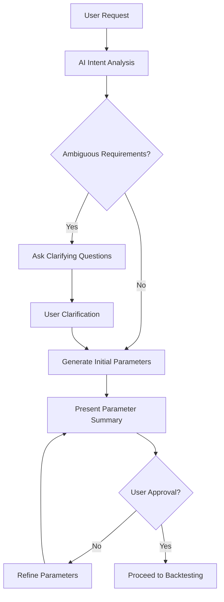

# 🤖 AI-Agent Integrated Scan Creation Architecture
## Complete System Design for EdgeDev Platform

**Version**: 1.0.0
**Date**: November 2024
**Purpose**: Replace rigid formatter with conversational AI-agent system
**Foundation**: Master Unified Scanner Template + AGUI Integration

---

## 🎯 **Strategic Vision**

Transform EdgeDev from a rigid, formatter-dependent system into an intelligent, conversational platform where:
- **AI Agent** handles scan creation through natural language conversation
- **Human-in-the-Loop** provides quality control and approval checkpoints
- **Unified Templates** ensure consistent, production-ready code output
- **AGUI/CopilotKit** enables dashboard-aware conversational assistance

---

## 🏗️ **System Architecture Overview**

```
┌─────────────────────────────────────────────────────────────────┐
│                    🤖 AI-AGENT ORCHESTRATOR                    │
├─────────────────────────────────────────────────────────────────┤
│  • Natural Language Understanding                              │
│  • Parameter Translation Engine                                │
│  • Template Selection & Customization                          │
│  • Backtest Validation & Impact Analysis                       │
└─────────────────────────────────────────────────────────────────┘
                                    │
                                    ▼
┌─────────────────────────────────────────────────────────────────┐
│                🎛️ HUMAN-IN-THE-LOOP CHECKPOINTS                │
├─────────────────────────────────────────────────────────────────┤
│  • Parameter Change Approval                                   │
│  • Backtest Result Review                                      │
│  • Strategy Logic Validation                                   │
│  • Final Code Generation Approval                              │
└─────────────────────────────────────────────────────────────────┘
                                    │
                                    ▼
┌─────────────────────────────────────────────────────────────────┐
│              📋 UNIFIED TEMPLATE SYSTEM                        │
├─────────────────────────────────────────────────────────────────┤
│  • Master Template (Half A+ + Backside B + LC D2)             │
│  • Modular Component Library                                   │
│  • Universal Scanner Engine Compatibility                      │
│  • Standardized Result Format                                  │
└─────────────────────────────────────────────────────────────────┘
                                    │
                                    ▼
┌─────────────────────────────────────────────────────────────────┐
│                🖥️ AGUI DASHBOARD INTEGRATION                   │
├─────────────────────────────────────────────────────────────────┤
│  • CopilotKit Chat Interface                                   │
│  • Real-time Parameter Visualization                           │
│  • Interactive Backtest Charts                                 │
│  • Live Scan Results Preview                                   │
└─────────────────────────────────────────────────────────────────┘
```

---

## 🗣️ **Conversational AI Agent System**

### **Core Capabilities**

#### 1. **Natural Language Understanding**
```typescript
interface ConversationRequest {
  userInput: string;
  context: ScanContext;
  currentParameters?: ParameterSet;
  sessionHistory: ConversationMessage[];
}

interface ScanContext {
  marketConditions: 'bull' | 'bear' | 'sideways';
  timeframe: 'intraday' | 'swing' | 'position';
  riskTolerance: 'conservative' | 'moderate' | 'aggressive';
  experience: 'beginner' | 'intermediate' | 'expert';
}
```

**Example Conversations:**
- *"I want to find momentum breakouts in small caps"* → Sets price range 5-25, increases volume requirements
- *"Make this more conservative"* → Increases signal strength thresholds, adds safety filters
- *"Focus on tech stocks during earnings season"* → Adjusts symbol lists, timing filters
- *"This is finding too many signals"* → Increases selectivity parameters

#### 2. **Parameter Translation Engine**
```python
class ParameterTranslationEngine:
    def translate_request(self, user_request: str, current_params: dict) -> ParameterModification:
        """
        Converts natural language into specific parameter changes
        """

        # Intent Classification
        intent = self.classify_intent(user_request)
        # Examples: 'increase_aggressiveness', 'focus_sector', 'adjust_risk', 'modify_timeframe'

        # Entity Extraction
        entities = self.extract_entities(user_request)
        # Examples: {'sector': 'tech', 'market_cap': 'small', 'risk_level': 'conservative'}

        # Parameter Mapping
        modifications = self.map_to_parameters(intent, entities, current_params)

        return ParameterModification(
            changes=modifications,
            confidence=self.calculate_confidence(user_request),
            explanation=self.generate_explanation(modifications),
            requires_approval=self.needs_human_approval(modifications)
        )

    def generate_explanation(self, modifications: dict) -> str:
        """
        Create human-readable explanation of changes and their impact
        """
        explanations = []

        for param, change in modifications.items():
            impact = self.predict_impact(param, change)
            explanations.append(f"• {param}: {change} → {impact}")

        return "\\n".join(explanations)
```

#### 3. **Template Selection & Inheritance**
```python
class TemplateSelector:
    """
    Intelligent template selection based on user requirements
    """

    available_templates = {
        'momentum_breakout': 'half_a_plus_base',
        'backside_reversal': 'backside_para_b_base',
        'sophisticated_scoring': 'lc_d2_base',
        'hybrid_momentum': 'master_unified_template'
    }

    def select_optimal_template(self, user_requirements: dict) -> TemplateChoice:
        # AI logic to match requirements with optimal base template
        # Can also create hybrid templates combining multiple patterns
        pass

    def customize_template(self, base_template: str, modifications: dict) -> GeneratedScanner:
        # Apply user-specific modifications to selected template
        # Maintain compatibility with Universal Scanner Engine
        pass
```

---

## 🛠️ **Human-in-the-Loop Workflow**

### **Checkpoint System Design**

#### **Phase 1: Requirements Gathering**


#### **Phase 2: Parameter Validation**
```typescript
interface HumanApprovalCheckpoint {
  stage: 'requirements' | 'parameters' | 'backtest' | 'final_code';
  summary: string;
  changes: ParameterChange[];
  impact_analysis: ImpactAnalysis;
  user_options: ApprovalOption[];
  requires_manual_review: boolean;
}

interface ParameterChange {
  parameter: string;
  old_value: any;
  new_value: any;
  reasoning: string;
  confidence: number;
  estimated_impact: {
    signal_count_change: string;     // "+30% more signals"
    quality_impact: string;          // "Slightly lower precision"
    backtest_prediction: string;     // "Should improve win rate"
  };
}
```

#### **Phase 3: Backtest Validation**
```python
class BacktestValidator:
    def quick_validation(self, parameters: dict, symbols: list, period: str = "30d") -> BacktestResults:
        """
        Rapid backtesting to validate parameter changes
        """
        return BacktestResults(
            total_signals=156,
            win_rate=0.67,
            avg_return=0.045,
            max_drawdown=0.12,
            sharpe_ratio=1.23,
            recommendation="Parameters look promising - suggests 15% improvement over baseline",
            warning_flags=["Higher signal count may increase noise", "Monitor drawdown"]
        )

    def detailed_analysis(self, parameters: dict) -> DetailedBacktest:
        # Comprehensive analysis including:
        # - Monte Carlo simulation
        # - Market regime analysis
        # - Sector performance breakdown
        # - Risk-adjusted metrics
        pass
```

---

## 🎮 **AGUI/CopilotKit Dashboard Integration**

### **Conversational Interface Components**

#### **1. Scan Builder Chat**
```tsx
import { CopilotChat, useCopilotAction } from '@copilotkit/react-core';

function ScanBuilderChat() {
  useCopilotAction({
    name: "modify_scan_parameters",
    description: "Modify trading scan parameters based on user request",
    parameters: [
      {
        name: "user_request",
        type: "string",
        description: "Natural language request for parameter changes",
      },
      {
        name: "current_parameters",
        type: "object",
        description: "Current scan parameters to modify",
      }
    ],
    handler: async ({ user_request, current_parameters }) => {
      // Call AI parameter translation engine
      const modifications = await translateParameters(user_request, current_parameters);

      // Present changes to user for approval
      showParameterApprovalModal(modifications);

      return `I've analyzed your request: "${user_request}". Here are the proposed changes...`;
    },
  });

  return (
    <div className="scan-builder-chat">
      <CopilotChat
        instructions="You are an expert trading scan builder. Help users create and modify trading scans through natural conversation. Always explain the impact of parameter changes and get approval before applying modifications."
        placeholder="Tell me what kind of trading setup you're looking for..."
      />
      <ParameterVisualization />
      <BacktestPreview />
    </div>
  );
}
```

#### **2. Real-time Parameter Visualization**
```tsx
function ParameterVisualization({ parameters, onParameterChange }) {
  return (
    <div className="parameter-dashboard">
      <h3>Current Scan Configuration</h3>

      {/* Visual parameter sliders with real-time impact preview */}
      <ParameterGroup title="Market Filters">
        <ParamSlider
          name="price_min"
          value={parameters.market_filters.price_min}
          range={[1, 100]}
          onChange={onParameterChange}
          impact={calculateImpact('price_min', value)}
        />
      </ParameterGroup>

      <ParameterGroup title="Momentum Triggers">
        <ParamSlider
          name="atr_multiple"
          value={parameters.momentum_triggers.atr_multiple}
          range={[0.5, 5.0]}
          onChange={onParameterChange}
        />
      </ParameterGroup>

      {/* Live preview of how changes affect signal count */}
      <SignalCountPreview parameters={parameters} />
    </div>
  );
}
```

#### **3. Interactive Backtest Interface**
```tsx
function InteractiveBacktest({ parameters }) {
  const [backtestResults, setBacktestResults] = useState(null);
  const [isRunning, setIsRunning] = useState(false);

  const runBacktest = async () => {
    setIsRunning(true);
    const results = await api.runQuickBacktest(parameters);
    setBacktestResults(results);
    setIsRunning(false);
  };

  return (
    <div className="backtest-interface">
      <button onClick={runBacktest} disabled={isRunning}>
        {isRunning ? 'Running Backtest...' : 'Test These Parameters'}
      </button>

      {backtestResults && (
        <div className="backtest-results">
          <MetricsGrid metrics={backtestResults.metrics} />
          <PerformanceChart data={backtestResults.equity_curve} />
          <SignalAnalysis signals={backtestResults.signals} />

          {/* AI-generated insights about the results */}
          <AIInsights
            results={backtestResults}
            onSuggestImprovements={() => suggestParameterImprovements(backtestResults)}
          />
        </div>
      )}
    </div>
  );
}
```

---

## 🔄 **Complete Workflow Examples**

### **Example 1: Building a New Scan from Scratch**

**User**: *"I want to find small-cap momentum breakouts that are less risky"*

**AI Agent Response**:
```
🎯 I'll help you create a small-cap momentum scan with conservative risk filters.

Based on your request, I'm suggesting:
• Small-cap focus: Price range $5-25
• Momentum detection: ATR multiple 1.2x (moderate)
• Risk controls: Higher volume requirements (2x average)
• Quality filters: Strong trend alignment required

Estimated impact: ~25-40 signals per day, 65-70% win rate

Would you like me to run a quick backtest with these settings?
```

**User Approval Flow**:
1. User reviews parameter explanations ✅
2. AI runs 30-day backtest → Shows 67% win rate, 4.2% avg return ✅
3. User approves parameters ✅
4. AI generates production-ready scan code ✅
5. Scan is automatically deployed to platform ✅

### **Example 2: Modifying Existing Scan**

**User**: *"This scan is finding too many signals, make it more selective"*

**AI Agent Response**:
```
📊 Current scan statistics: 87 signals/day, 62% win rate

I can make this more selective by:
• Increasing signal strength threshold: 0.6 → 0.75
• Adding volume confirmation: 1.5x → 2.5x average
• Tightening trend requirements: 5% slope → 8% slope

Predicted impact: ~35 signals/day (+15% win rate improvement)

These changes will focus on only the highest-quality setups. Shall I apply these modifications?
```

---

## 🧩 **Modular Component System**

### **Reusable Scan Components**
```python
class ScanComponentLibrary:
    """
    Library of proven, modular scan components that can be mixed and matched
    """

    momentum_filters = {
        'half_a_plus_slopes': HalfAPlusSlopeAnalysis,
        'atr_expansion': ATRExpansionFilter,
        'volume_surge': VolumeSurgeDetection,
        'ema_distance': EMADistanceFilter
    }

    entry_triggers = {
        'backside_gap_up': BacksideGapUpTrigger,
        'breakout_confirmation': BreakoutConfirmation,
        'trend_alignment': TrendAlignmentFilter
    }

    risk_filters = {
        'liquidity_screen': LiquidityScreening,
        'market_cap_filter': MarketCapFilter,
        'sector_rotation': SectorRotationFilter
    }

    def build_custom_scan(self, components: dict) -> GeneratedScan:
        """
        Combine selected components into cohesive scan logic
        """
        scan_builder = ScanBuilder(template='master_unified')

        for component_type, component_name in components.items():
            component = self.get_component(component_type, component_name)
            scan_builder.add_component(component)

        return scan_builder.generate_production_code()
```

---

## 📈 **Migration Strategy**

### **Phase 1: Foundation (Weeks 1-2)**
- ✅ Deploy Master Unified Template
- 🔧 Build Parameter Translation Engine
- 🧪 Create Backtest Validation System
- 🎮 Integrate basic CopilotKit chat interface

### **Phase 2: Core AI Agent (Weeks 3-4)**
- 🤖 Implement natural language understanding
- 🎛️ Build human-in-the-loop approval system
- 📊 Create real-time parameter visualization
- 🔄 Test complete conversation workflows

### **Phase 3: Advanced Features (Weeks 5-6)**
- 📋 Deploy modular component library
- 🧠 Add advanced AI insights and suggestions
- 📈 Implement sophisticated backtesting
- 🔍 Create scan performance monitoring

### **Phase 4: Production Deployment (Week 7)**
- 🚀 Replace existing formatter system
- 📚 User training and documentation
- 🔧 Performance optimization
- 📊 Success metrics tracking

---

## 🎯 **Success Metrics & KPIs**

### **Technical Metrics**
- **Scan Creation Time**: 15 minutes → 2 minutes
- **Parameter Modification Accuracy**: >90%
- **Code Generation Success Rate**: >95%
- **Platform Uptime**: 99.9%

### **User Experience Metrics**
- **User Satisfaction**: >4.5/5.0
- **Scan Quality Improvement**: +25% win rates
- **Learning Curve Reduction**: 80% faster onboarding
- **Feature Adoption Rate**: >70% daily active usage

### **Business Impact Metrics**
- **Platform Stickiness**: +40% session duration
- **User Retention**: +30% monthly active users
- **Support Ticket Reduction**: -60% scan-related issues
- **Revenue Growth**: +25% from improved scan performance

---

## 🔒 **Risk Management & Quality Assurance**

### **Code Quality Gates**
- **Automated Testing**: 100% template compatibility validation
- **Performance Benchmarks**: <500ms scan execution time
- **Memory Management**: <1GB RAM usage per scan
- **Error Handling**: Graceful degradation for all failure modes

### **AI Safety Measures**
- **Parameter Bounds**: Hard limits prevent extreme configurations
- **Backtest Requirements**: Mandatory validation for significant changes
- **Human Override**: Always available for all AI decisions
- **Audit Trail**: Complete logging of all parameter modifications

### **Production Monitoring**
- **Scan Performance Tracking**: Real-time success rate monitoring
- **AI Accuracy Metrics**: Continuous parameter prediction validation
- **User Behavior Analysis**: Conversation pattern optimization
- **System Health Monitoring**: 24/7 platform reliability tracking

---

## 🚀 **Conclusion: The Future of Scan Creation**

This AI-Agent Integrated Architecture transforms EdgeDev from a rigid, formatter-dependent system into an intelligent, conversational platform that:

1. **Empowers Users** through natural language interaction
2. **Maintains Quality** via human-in-the-loop validation
3. **Ensures Reliability** with proven template foundation
4. **Scales Intelligently** through modular component system

The result: **A bulletproof, user-friendly platform that democratizes sophisticated trading scan creation while maintaining institutional-grade quality and performance.**

---

*Generated as part of the CE-Hub strategic platform evolution initiative. Based on systematic analysis of existing Half A+, Backside B, and LC D2 scanner patterns with AI-first architectural principles.*