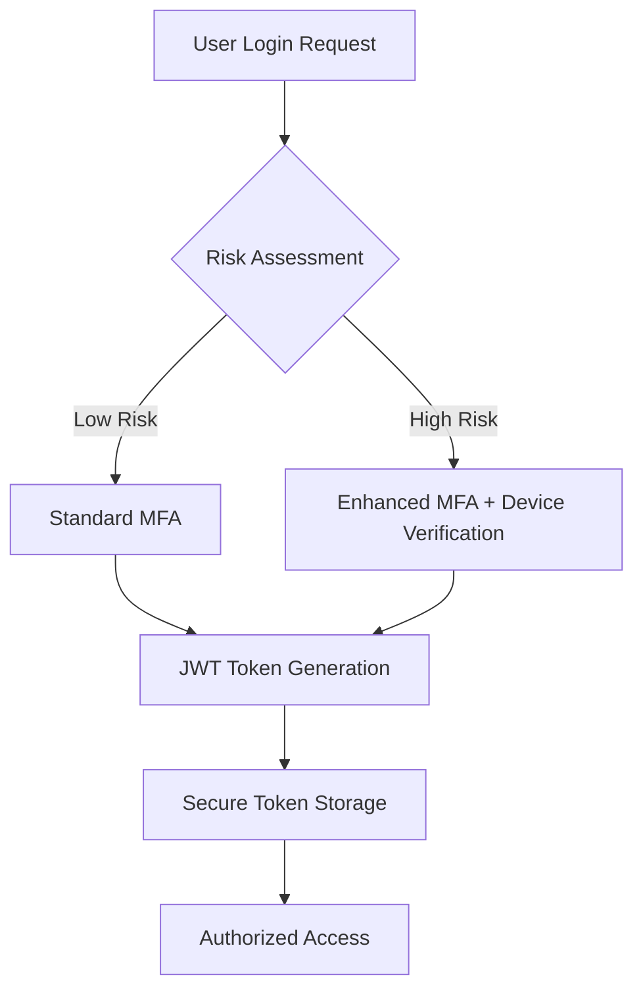

# SaaS Authentication System - Comprehensive Planning Document

## Executive Summary

This document outlines the complete planning, research, and implementation strategy for a production-ready SaaS authentication system. The system will provide SSO, MFA, social login, and GDPR compliance capabilities for applications expecting 10K+ users.

## 1. Requirements Analysis

### Core Authentication Features
- **Single Sign-On (SSO)**: SAML 2.0 and OAuth 2.0/OpenID Connect support
- **Multi-Factor Authentication (MFA)**: Adaptive/risk-based MFA with FIDO2/WebAuthn
- **Social Login**: Google, GitHub, Microsoft Azure AD integration
- **Traditional Auth**: Email/password with secure password reset
- **Email Verification**: Automated verification workflows
- **Session Management**: JWT tokens with refresh token rotation

### Technical Requirements
- **Frontend**: React.js integration with authentication hooks
- **Backend**: Node.js/Express API with secure token handling
- **Database**: PostgreSQL with encrypted user data storage
- **Cloud Platform**: AWS/Supabase with edge function support
- **Compliance**: GDPR, SOC2 Type 2, ISO 27001 readiness

### Scale & Performance
- **User Volume**: 10K+ active users with horizontal scaling
- **Global Distribution**: Multi-region deployment capability
- **Availability**: 99.9% SLA with automated failover
- **Performance**: <200ms authentication response times

## 2. Security Architecture

### Authentication Flow Security
Based on industry best practices for 2024:



### Token Security Implementation
- **Access Tokens**: Short-lived (5-15 minutes) with limited scope
- **Refresh Tokens**: Secure storage with rotation on each use
- **Token Encryption**: AES-256 encryption for sensitive payloads
- **Scope Management**: Principle of least privilege enforcement

### Modern MFA Implementation
- **Primary Methods**: FIDO2/WebAuthn for phishing resistance
- **Backup Methods**: TOTP, SMS, backup codes
- **Adaptive Logic**: Risk-based authentication based on:
  - Device reputation and fingerprinting
  - Geolocation and IP analysis
  - Behavioral pattern recognition
  - Time-based access patterns

## 3. Technical Implementation Plan

### Phase 1: Foundation (Weeks 1-2)
**Objectives**: Core authentication infrastructure

**Deliverables**:
- PostgreSQL database schema with encrypted user storage
- JWT token generation and validation system
- Basic email/password authentication endpoints
- Password hashing with Argon2id
- Rate limiting and security headers implementation

**Acceptance Criteria**:
- User registration and login functional
- Secure password storage validated
- Basic security audit passed
- Load testing for 1K concurrent users

### Phase 2: Enterprise Features (Weeks 3-4)
**Objectives**: SSO and advanced authentication

**Deliverables**:
- SAML 2.0 identity provider integration
- OAuth 2.0/OpenID Connect implementation
- Social login providers (Google, GitHub, Microsoft)
- Email verification workflows
- Password reset functionality

**Acceptance Criteria**:
- SSO integration tested with major IDPs
- Social login fully functional
- Email workflows operational
- Security penetration testing passed

### Phase 3: MFA & Security (Weeks 5-6)
**Objectives**: Multi-factor authentication and advanced security

**Deliverables**:
- FIDO2/WebAuthn implementation
- TOTP authenticator app support
- Risk-based adaptive MFA engine
- Device fingerprinting and management
- Audit logging and monitoring

**Acceptance Criteria**:
- MFA enrollment and authentication functional
- Risk engine accurately assessing threats
- Comprehensive audit trail implemented
- Compliance requirements validated

### Phase 4: Frontend Integration (Weeks 7-8)
**Objectives**: React frontend integration and UX

**Deliverables**:
- React authentication hooks and context
- Responsive login/registration UI components
- MFA enrollment and management interface
- User profile and security settings
- Error handling and loading states

**Acceptance Criteria**:
- Seamless frontend/backend integration
- Excellent user experience validated
- Mobile responsiveness confirmed
- Accessibility standards met (WCAG 2.1)

## 4. Compliance & Security Standards

### GDPR Compliance Implementation
- **Data Minimization**: Collect only necessary authentication data
- **Consent Management**: Explicit consent for data processing
- **Right to Deletion**: Complete user data removal capability
- **Data Portability**: User data export functionality
- **Privacy by Design**: Built-in privacy protections

### SOC2 Type 2 Preparation
- **Access Controls**: Role-based access control (RBAC)
- **Logical Security**: Multi-layered security architecture
- **System Operations**: Comprehensive monitoring and alerting
- **Change Management**: Controlled deployment processes
- **Risk Management**: Regular security assessments

### Security Monitoring
- **Real-time Alerts**: Suspicious login attempts and anomalies
- **Audit Logging**: Comprehensive authentication event tracking
- **Threat Detection**: ML-powered anomaly detection
- **Incident Response**: Automated security response procedures

## 5. Technology Stack Decisions

### Backend Architecture
```typescript
// Core Authentication Service
interface AuthService {
  authenticate(credentials: LoginCredentials): Promise<AuthResult>
  validateToken(token: string): Promise<TokenValidation>
  refreshToken(refreshToken: string): Promise<TokenPair>
  enrollMFA(userId: string, method: MFAMethod): Promise<MFAEnrollment>
  validateMFA(userId: string, code: string): Promise<boolean>
}
```

### Database Schema
```sql
-- Core Users Table
CREATE TABLE users (
  id UUID PRIMARY KEY DEFAULT gen_random_uuid(),
  email VARCHAR(255) UNIQUE NOT NULL,
  password_hash VARCHAR(255),
  email_verified BOOLEAN DEFAULT false,
  created_at TIMESTAMP DEFAULT NOW(),
  updated_at TIMESTAMP DEFAULT NOW(),
  metadata JSONB
);

-- MFA Methods Table
CREATE TABLE user_mfa_methods (
  id UUID PRIMARY KEY DEFAULT gen_random_uuid(),
  user_id UUID REFERENCES users(id) ON DELETE CASCADE,
  method_type VARCHAR(50) NOT NULL,
  secret_encrypted TEXT,
  backup_codes_encrypted TEXT[],
  enabled BOOLEAN DEFAULT true,
  created_at TIMESTAMP DEFAULT NOW()
);
```

### Frontend React Hooks
```typescript
// Authentication Hook
export const useAuth = () => {
  const [user, setUser] = useState<User | null>(null)
  const [loading, setLoading] = useState(true)

  const login = useCallback(async (credentials: LoginCredentials) => {
    // Implementation with MFA handling
  }, [])

  const logout = useCallback(async () => {
    // Secure logout with token invalidation
  }, [])

  return { user, login, logout, loading }
}
```

## 6. Testing & Quality Assurance

### Security Testing Strategy
- **Penetration Testing**: Third-party security audit
- **Vulnerability Scanning**: Automated security scanning
- **Code Review**: Security-focused code review process
- **Compliance Audit**: SOC2 and GDPR compliance validation

### Performance Testing
- **Load Testing**: 10K+ concurrent user simulation
- **Stress Testing**: System breaking point identification
- **Latency Testing**: <200ms response time validation
- **Scalability Testing**: Auto-scaling effectiveness

### User Experience Testing
- **Usability Testing**: User authentication journey validation
- **Accessibility Testing**: WCAG 2.1 compliance verification
- **Cross-browser Testing**: Major browser compatibility
- **Mobile Testing**: Responsive design validation

## 7. Deployment & Operations

### Infrastructure Architecture
- **Primary Region**: AWS us-east-1 (or Supabase primary)
- **Secondary Region**: AWS eu-west-1 for EU users
- **CDN**: CloudFront for global asset distribution
- **Database**: Multi-AZ PostgreSQL with automated backups
- **Monitoring**: DataDog for comprehensive system monitoring

### CI/CD Pipeline
1. **Code Commit**: GitHub with protected main branch
2. **Automated Testing**: Jest/Cypress test suite execution
3. **Security Scanning**: Snyk/SonarQube security analysis
4. **Staging Deployment**: Automated staging environment deployment
5. **Production Deployment**: Blue-green deployment strategy

### Monitoring & Alerting
- **Authentication Metrics**: Login success/failure rates
- **Performance Metrics**: Response times and error rates
- **Security Metrics**: Failed attempts and anomalies
- **Business Metrics**: User registration and retention

## 8. Risk Assessment & Mitigation

### Security Risks
| Risk | Impact | Probability | Mitigation |
|------|--------|-------------|------------|
| Credential stuffing attacks | High | Medium | Rate limiting, MFA, monitoring |
| JWT token theft | High | Low | Short expiration, secure storage |
| Social engineering | Medium | Medium | User education, MFA requirements |
| Database breach | High | Low | Encryption, access controls, monitoring |

### Operational Risks
| Risk | Impact | Probability | Mitigation |
|------|--------|-------------|------------|
| Service downtime | High | Low | Multi-region, automated failover |
| Scaling issues | Medium | Medium | Auto-scaling, performance monitoring |
| Compliance violations | High | Low | Regular audits, automated compliance |

## 9. Success Metrics & KPIs

### Security Metrics
- **Authentication Success Rate**: >99.5%
- **Security Incident Response**: <1 hour to containment
- **MFA Adoption Rate**: >80% of users
- **Failed Login Attempts**: <0.1% of total attempts

### Performance Metrics
- **Authentication Latency**: <200ms average
- **System Availability**: >99.9% uptime
- **Concurrent Users**: 10K+ supported
- **Database Response Time**: <50ms queries

### User Experience Metrics
- **Registration Completion**: >90% completion rate
- **Login Success Rate**: >99% for valid credentials
- **User Satisfaction**: >4.5/5 authentication experience
- **Support Tickets**: <1% authentication-related issues

## 10. Implementation Timeline

### Detailed Project Schedule
```gantt
title SaaS Authentication System Implementation
dateFormat YYYY-MM-DD
section Foundation
Database Setup: 2024-01-01, 3d
Basic Auth API: 2024-01-04, 4d
Security Testing: 2024-01-08, 2d
section Enterprise Features
SSO Integration: 2024-01-11, 5d
Social Login: 2024-01-16, 3d
Email Workflows: 2024-01-19, 2d
section MFA & Security
FIDO2 Implementation: 2024-01-22, 4d
Risk Engine: 2024-01-26, 3d
Audit System: 2024-01-29, 2d
section Frontend
React Integration: 2024-02-01, 5d
UI Components: 2024-02-06, 4d
Testing & Polish: 2024-02-10, 3d
```

## 11. Post-Launch Considerations

### Ongoing Maintenance
- **Security Updates**: Monthly security patch cycles
- **Performance Optimization**: Quarterly performance reviews
- **Feature Enhancement**: User feedback integration
- **Compliance Monitoring**: Continuous compliance validation

### Scaling Strategy
- **User Growth**: Auto-scaling for 100K+ users
- **Geographic Expansion**: Additional regional deployments
- **Feature Evolution**: Advanced authentication features
- **Enterprise Features**: Custom SSO implementations

---

## Conclusion

This comprehensive planning document provides a complete roadmap for implementing a production-ready SaaS authentication system. The architecture balances security, performance, and user experience while maintaining compliance with modern standards.

**Next Steps:**
1. Stakeholder review and approval
2. Development team assignment
3. Infrastructure provisioning
4. Sprint planning and execution

**Key Success Factors:**
- Security-first design approach
- Comprehensive testing strategy
- Phased implementation with validation
- Continuous monitoring and improvement

This system will provide a robust foundation for secure user authentication that can scale with business growth while maintaining the highest security standards.